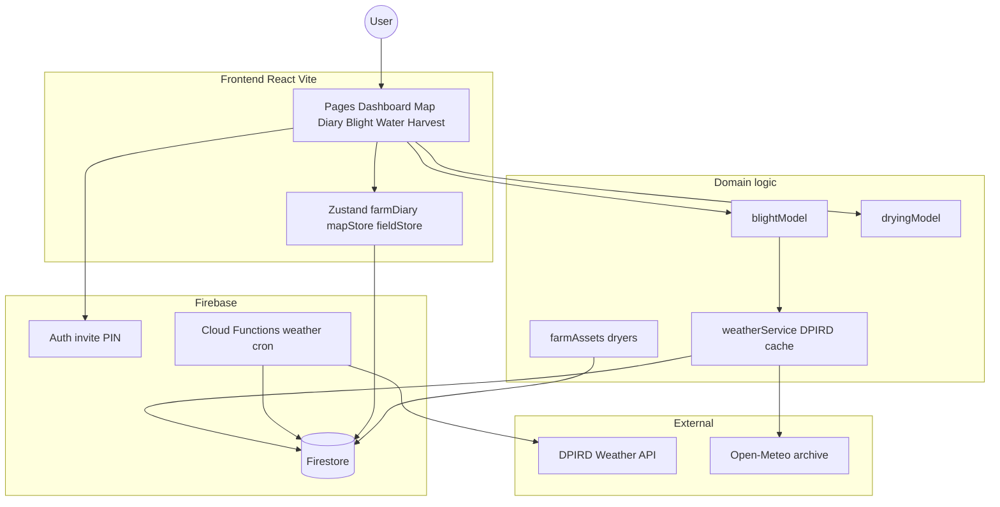
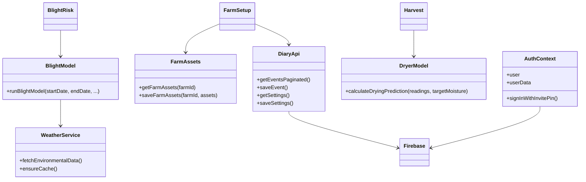

# Developer Notes: Architecture & Scalability Audit

**Date:** April 2026
**Current Phase:** Prototype / Thick Client
**Target Scale:** 10,000+ Concurrent Users

## 0. Naming glossary (display vs wire)

| Name | Role |
|------|------|
| **PUF-AM** / **PUF-AM — Ag Manager** | User-facing display name (Login, shell header, About, Capacitor `appName`, HTML title). Source: `src/brand.ts`. |
| **PUF-AM** (GitHub) | Active repo: [paraquatsundae/PUF-AM](https://github.com/paraquatsundae/PUF-AM). Local clone folder may remain `Walnut_farm_manager` — do not require renaming the directory. |
| **PUFOM** | Legacy / wire protocol brand: `.pufom` bundles, `PUFOM1` magic, mDNS `_pufom-sync._tcp`, keys `pufom_*`, Cloud Run service `pufom-…`. Unchanged — do **not** rename casually. |
| **walnut-farm-manager** | npm `package.json` `name` — technical id only; leave as-is so scripts stay stable. |
| **com.sentinut.farm** | Capacitor / Android `appId` — keep for install continuity. |
| **sentinut_*** | localStorage / IndexedDB key prefixes — keep for data continuity. |
| **Walnut-Farm-Manager** (archived) | Legacy GitHub repo [paraquatsundae/Walnut-Farm-Manager](https://github.com/paraquatsundae/Walnut-Farm-Manager) — archived; not the active remote. |

Full rename plan: [`Plans/RENAME_TO_PUFAM.md`](Plans/RENAME_TO_PUFAM.md).

### Mist network & storage (experimental)

**Firebase Auth + invite PINs remain the shipping path.** A longer-term “mist” design (local-first + Reticulum on-farm mesh + Freenet-style encrypted peer redundancy, no email / no subscription cloud) is documented as an **experimental fork** — do not merge it over production auth until proven.

- Full plan: [`Plans/MIST_NETWORK_STORAGE.md`](Plans/MIST_NETWORK_STORAGE.md)
- Includes: data placement (farm bones on mist), hot/archive/manifest Freenet shape, **`FarmStore` plug-in units**, first-run FarmCode recovery UX, map heads-up over Reticulum, and **invitation → key derivation → contract keys** (paper farm code + invite token).

### Workshop hub keep-alive

Bare `npm run dev` started from a Cursor agent shell often dies when the agent turn ends (`ERR_CONNECTION_REFUSED` on `:3000`). For a durable workshop hub:

```bash
nohup bash scripts/dev-keepalive.sh >/tmp/pufam-dev-keepalive.out 2>&1 & disown
# health: http://localhost:3000/api/health  ·  log: /tmp/pufam-dev.log
```

## 1. The Good News: What We've Optimized
We have made some smart decisions that buy us time and performance:
*   **Decoupled UI (The Temporal Slider):** By ensuring the time-scrubbing slider only filters pre-loaded data, we prevented a catastrophic scenario where sliding the timeline would trigger hundreds of database queries per second.
*   **Aggressive Memoization:** We recently wrapped our heavy calculations (like `blockAnalytics` and `blockSprayEventsCache`) in React `useMemo`. This stops the app from recalculating the entire farm's risk profile every time a user clicks a button or opens a menu.
*   **Basic Caching & Normalization:** We implemented a cache for DPIRD weather data in Firestore and standardized station code logic (e.g., mapping Manjimup to the stable 'MA002' code). This prevents external API churn and ensures reliability for regional anchors.
*   **Traceability & Operator Context:** Added operator notation fields to Drying Bin readings and temperature logs, allowing non-numerical data (vent adjustments, visual observations) to be persisted alongside statistical curves.

## 2. The Danger Zones: Where We Will Break at Scale
Despite the optimizations above, the current architecture is still a "Prototype/Thick Client" model. Here is where it will fail under heavy load:

### A. Map Rendering Limits (DOM Overload)
*   **The Issue:** We are currently rendering every block (polygon), track (polyline), and event (marker) directly onto the Leaflet map at all times. 
*   **The Breakpoint:** Leaflet uses SVG/DOM elements for these layers. If a commercial farm has 2,000 blocks and 500 daily event markers, the browser has to manage 2,500+ complex DOM nodes. On a mobile device, this will cause severe frame-rate drops, battery drain, and eventually crash the browser tab due to memory exhaustion.
*   **The Enterprise Fix:** We need to implement **Marker Clustering** for pins/events, and transition to **Vector Tiles** or implement **Bounding Box Queries** (only loading and rendering the polygons that are currently visible within the user's screen coordinates).

### B. The "Thundering Herd" API Problem
*   **The Issue:** Our weather caching logic is triggered by the *client*. If the cache is expired, the client fetches the DPIRD API and saves it to Firestore.
*   **The Breakpoint:** Imagine 5,000 farm managers all opening the app at 7:00 AM. They all see an expired cache, and all 5,000 clients simultaneously request data from the DPIRD API before the first one can save the new cache to Firestore. We will instantly hit rate limits and be blocked by the weather provider.
*   **The Enterprise Fix:** We must move this to a **Backend Cron Job** (e.g., Firebase Cloud Scheduler). The server fetches the weather every hour in the background and updates Firestore. The clients *never* talk to the weather API directly; they only read the database.

### C. Payload Sizes & Database Read Costs
*   **The Issue:** When the app loads, we fetch *all* blocks, *all* tracks, and *all* events within a date range. 
*   **The Breakpoint:** As farms accumulate years of historical data, the JSON payload sent to the client will grow exponentially. Downloading 10MB of JSON over a weak 3G connection in an orchard will result in a massive loading screen delay. Furthermore, fetching 10,000 documents per user login will cause your Firebase read costs to skyrocket.
*   **The Enterprise Fix:** We need **Pagination** and **Data Aggregation**. We should only load the last 7 days of events by default. For historical analytics, the backend should calculate the summaries and store them in a single "Summary Document" so the client only pays for 1 database read instead of 10,000.

### D. Client-Side CPU Bottleneck
*   **The Issue:** Even with memoization, the actual math for the Blight Engine and Profitability calculations is happening on the user's device.
*   **The Breakpoint:** Older smartphones have weak CPUs. Forcing them to iterate through arrays of thousands of spray events to calculate protection windows will freeze the UI thread.
*   **The Enterprise Fix:** **Backend Offloading**. Complex business logic must be moved to Firebase Cloud Functions. The server does the heavy lifting and sends the client a simple, pre-calculated number.

## 3. AI Cost Management — removed

Gemini / LLM features (Predictive Insights, `aiService.ts`, Google Search grounding) have been **removed**. Remaining forecasting (blight) is deterministic model math, not generative AI.

---

## Summary Verdict
*   **Functionality:** Strong orchard tools remain (map, diary, blight, harvest, financials).
*   **Scalability:** Improved by Phase A–C work; still workshop-first for paddock UX.

To transition from a prototype to an enterprise platform, focus on **Backend Offloading** (Cloud Functions), **Data Pagination**, **Map Viewport Optimization**, and **paddock-first navigation**.

---

## 4. System Architecture & Data Flow

### High-Level Design


### UML Class Diagram


### Key module explanations
*   **Paddock loop:** Map (blocks + issue pins) → Diary (plans / sprays / water / nutrition) → Blight (protection vs threat). Home surfaces open issues and plans.
*   **Farm setup:** Dryers, water allocation (ML), irrigation method — rare edits; Water and drying read these.
*   **Blight risk engine:** Migrating to **Ji et al. 2025** process model (see §4.2). Legacy PUFOM multiplicative index remains for Research / what-if until cut over is complete.
*   **Dryer engine:** Exponential decay fit on moisture readings for configured dryers.
*   **Nutrition / water pages:** Application diaries writing `DiaryEvent` records (soil lab XLSX deferred; `nutritionService` retained for later).
*   **Auth:** Invite PIN sessions (not Google-only). Workshop mode can run UI without Firestore. See §4.1 Auth UX.
*   **Weather:** Prefer Firestore cache + Cloud Functions refresh; client may ensure/backfill in dev.

### 4.1 Auth UX (invite PIN → device session → unlock PIN)

**Decision (July 2026):** Keep farm access via **invite PIN** (admin-minted). Do not add password / email recovery for `@sentinut.local` accounts.

| Phase | Behaviour | Status |
|-------|-----------|--------|
| **Now** | After first successful invite PIN + name sign-in, **remember this device**: Firebase Auth IndexedDB persistence. Reopening skips login until logout / wipe. Welcome-back + last farm (`deviceSession.ts`). | Implemented |
| **Now** | Optional **personal unlock PIN** (4–8 digits, per device / UID): setup prompt + Settings; soft lock gate + 15 min background relock (`unlockPin.ts`, `AppUnlockGate`). Invite PIN still required once per **new device**. | Implemented |
| **Later** | Biometric unlock (Capacitor) wrapping the same local unlock secret. | Planned |

Rationale: orchard tablets should stay open without re-typing the farm invite code every shift; unlock PIN adds a light privacy gate without inventing passwords for synthetic Auth emails.

Details: [`Plans/AUTH_INVITE_PIN.md`](Plans/AUTH_INVITE_PIN.md).

### 4.2 Blight engine — Ji et al. 2025 core (July 2026)

**Decision:** Production Forecast / Historical blight risk will use the **Ji et al. 2025** mechanistic weather-based model (*Plant Disease* 109:1130–1141), not the homemade PUFOM T×W multiplicative index.

| Piece | Approach |
|-------|----------|
| Primary inoculum | \(Y_i = k(1-a^{\sum R})\), \(a=0.916\); orchard \(k\) from history / buds (later) |
| Infection | \(INFR = f(T)\times f(WD)\) — Beta (\(T_{\min}=10\), \(T_{\max}=24\)) × Gompertz wetness (published params frozen) |
| Incubation | 15–21 day delay (secondary inoculum) — next slice |
| Wetness (interim) | Rain + high-RH proxy (from local Mathematica notebook); target = hourly / on-farm LWD |
| Protection / chem-bio | Research sandbox only — not on Forecast/Historical |
| AU second track | Lang moisture-intensity overlay later (Ji notes XanthoCast weak in wet AU seasons) |

**Authoritative plan:** [`Plans/BLIGHT_VALIDATION.md`](Plans/BLIGHT_VALIDATION.md)  
**Code (in progress):** `shared/weather/jiBlightModel.ts` · golden fixture from notebook 32-day series  
**Local research pack:** `Documents\Agronomy'\2026\Walnut\Blight forecasting\` (Ji PDF + Mathematica notebooks)

Do **not** expose published Ji coefficients as farm “calibration” knobs — only orchard \(k\) (and optional density extension) are farm-tunable.

---

## 5. Production Roadmap — 13-Step Checklist

**Authoritative plan:** [`Plans/ROADMAP.md`](Plans/ROADMAP.md) — full task breakdown, acceptance criteria, dependencies, and progress log.

**Last updated:** 13 July 2026 (Phase B complete)

Update the **Status** column here whenever a step changes. Mirror details in `Plans/ROADMAP.md` → Progress log.

### Phase A — Workshop readiness

| Step | ID | Task | Status |
|------|-----|------|--------|
| 1 | `STEP-01` | Initialize git; gitignore secrets; add `firebase-applet-config.example.json` | `done` |
| 2 | `STEP-02` | Create local `.env` from `.env.example` (DPIRD, Google Maps) | `done` |
| 3 | `STEP-03` | Smoke-test `npm run dev` against Firebase — log in `Plans/SMOKE_TEST_LOG.md` | `done` |
| 4 | `STEP-04` | Rename `package.json` from `react-example` → `walnut-farm-manager` | `done` |

### Phase B — Beta readiness

| Step | ID | Task | Status |
|------|-----|------|--------|
| 5 | `STEP-05` | Add Vitest smoke tests: blight model, dryer model, API health | `done` |
| 6 | `STEP-06` | Code-split heavy routes; reduce main bundle from ~4.1 MB | `done` |
| 7 | `STEP-07` | Wire or remove Billing page (decision: defer / remove / implement) | `done` |
| 8 | `STEP-08` | `npm audit` — remediate critical vulnerabilities; log in `Plans/AUDIT_LOG.md` | `done` |

### Phase C — Production / scale

| Step | ID | Task | Status |
|------|-----|------|--------|
| 9 | `STEP-09` | Cloud Scheduler for DPIRD weather — clients read cache only | `done` |
| 10 | `STEP-10` | Pagination for events, harvests, financial transactions | `done` |
| 11 | `STEP-11` | Map marker clustering + bounding-box queries | `done` |
| 12 | `STEP-12` | Cloud Functions for blight + financial aggregates | `done` |
| 13 | `STEP-13` | Replace hardcoded admin email with Firebase custom claims | `done` |

### Cross-reference to scalability audit (§2)

| Roadmap step | Addresses audit item |
|--------------|---------------------|
| Step 9 | §2B — Thundering herd API problem |
| Step 10 | §2C — Payload sizes & database read costs |
| Step 11 | §2A — Map rendering limits (DOM overload) |
| Step 12 | §2D — Client-side CPU bottleneck |

### Progress summary

| Phase | Done | Total |
|-------|------|-------|
| A — Workshop | 4 | 4 |
| B — Beta | 4 | 4 |
| C — Production | 5 | 5 |
| **All** | **13** | **13** |
