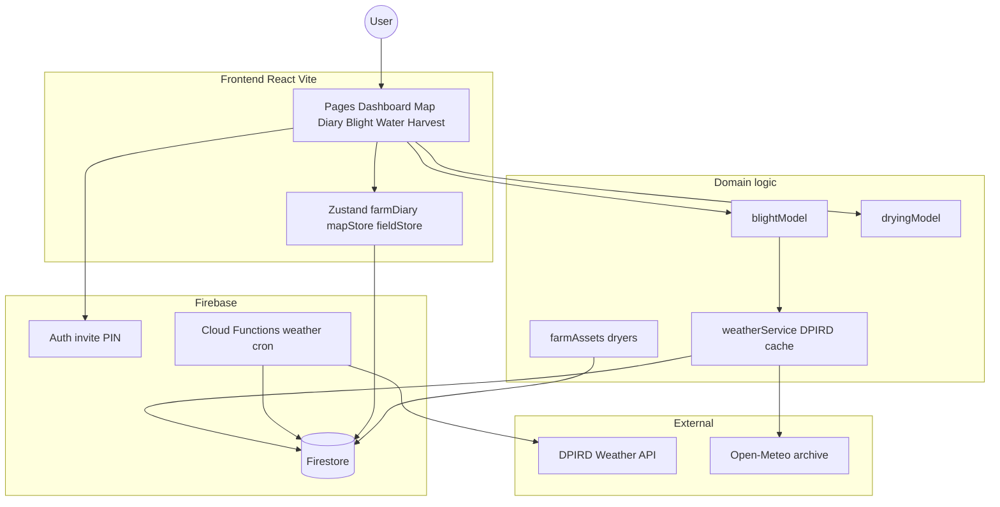

# Developer Notes: Architecture & Scalability Audit

**Date:** April 2026
**Current Phase:** Prototype / Thick Client
**Target Scale:** 10,000+ Concurrent Users

## 0. Naming (display vs wire)

**Authoritative reference:** [`Plans/NAMING.md`](Plans/NAMING.md) — product names, env vars, IndexedDB/localStorage keys, mist paths, export formats, Firestore layout, doc procedures, legacy vs preferred.

Quick map: operators see **PUF-AM** (`src/brand.ts`); wire/sync stays **PUFOM** (`.pufom`, `pufom_*`, `_pufom-sync._tcp`); Android **`com.sentinut.farm`** and **`sentinut_*`** storage are frozen for continuity. Rebrand checklist: [`Plans/RENAME_TO_PUFAM.md`](Plans/RENAME_TO_PUFAM.md).

### Mist network & storage (experimental)

**Firebase Auth + invite PINs remain the shipping path.** A longer-term “mist” design (local-first + Reticulum on-farm mesh + Freenet-style encrypted peer redundancy, no email / no subscription cloud) is documented as an **experimental fork** — do not merge it over production auth until proven.

- Full plan: [`Plans/MIST_NETWORK_STORAGE.md`](Plans/MIST_NETWORK_STORAGE.md)
- **Phase 1 contract (frozen API):** [`units/mist-freenet/`](units/mist-freenet/) — types + `MistStore` + `FarmStoreAdapter`; no app wiring yet.
- **Phase 2 local disk (done):** `DiskMistStore` + `sealHotPeriod()` in the same unit — Node-only persistence; import `./src/node.ts` from main process.
- **Phase 3 Freenet adapter (done):** `FreenetMistStore` + `FcpFreenetTransport` / `Freenet02WsTransport` / `MockFreenetTransport` — disk cache + put/get; import `./src/node.ts` or `./src/freenet.ts`.
- **Phase 4 app wiring (done):** FarmCode (`mist-fc-1`), `src/mist/` FarmStore factory + mist first-run at `/login/mist-new-farm`, Settings bones workshop. Default backend remains Firebase.
- **Phase 5 reload survival (done):** `IndexedDbMistStore`, encrypted device session + PIN unlock gate, bones persist across reload. Per-device only until Freenet sync.
- **Phase 6 FarmCode recovery (done):** `/login/mist-recover` — laptop B enters existing FarmCode → same `farmId` + local IndexedDB; blobs from laptop A stay local-only until Freenet sync ships.
- **Phase 7 local → Hot bridge (done):** `mistHotBridge.ts` — diary/issues from `pufom_farm_local` → `hot/current` (AEAD via `freenet-hot` HKDF); auto-publish when mist device session active; Settings workshop UI. Firestore/outbox unchanged.
- **Phase 8 two-laptop smoke (done, ~2026-08-03):** Pre-Freenet two-laptop pass — Laptop A create + local Hot; Laptop B **FarmCode recovery** → same `farmId` on localhost; bones/Hot per-device (expected). See [`Plans/MIST_TWO_LAPTOP_SMOKE.md`](Plans/MIST_TWO_LAPTOP_SMOKE.md).
- **Phase 9+ (pre-Freenet workshop frozen ~2026-08-03):** Reticulum unit, invite join QR, in-process Freenet client plug-in, cross-device bone sync, `sealHotPeriod` app trigger. **Phase 9 in-process Freenet plug-in — ws02 transport added ~2026-08-03** (Freenet 0.2 WebSocket on :7509 + legacy FCP; workshop publish/pull Hot).
- **Phase 9 disaster-recovery smoke (done):** `mistDisasterRecovery.ts` + Settings → *Freenet loss / recovery smoke* — publish Hot → Freenet, wipe local `pufom_farm_local` + hot/current, pull + rehydrate. FarmCode/device session preserved. Unit tests: `src/mist/mistDisasterRecovery.test.ts`.
- **Phase 10 two-Fedora Freenet (workshop, Option A):** Cross-laptop Hot + bones via **join ticket** (`{ hotUri, bonesUri }`). See [`Plans/MIST_TWO_FEDORA_FREENET.md`](Plans/MIST_TWO_FEDORA_FREENET.md). Option B (deterministic mutable contract) deferred.
- **Phase 10b production + local sidecar (~2026-08-03):** `am.pufworks.farm` ships mist UI (`VITE_MIST_EXPERIMENTAL=true`); Freenet API calls default to `http://127.0.0.1:3000` sidecar (`getMistFreenetApiBaseUrl`). Cloud Run sets `MIST_FREENET_DISABLED=1`. Each laptop runs `freenet network` + `MIST_FREENET=1 npm run dev` while browsing production HTTPS.
- **Phase 11 desktop installer + Freenet as an in-app plugin (planned + scaffolded ~2026-08-03):** [`Plans/DESKTOP_FREENET_PLUGIN.md`](Plans/DESKTOP_FREENET_PLUGIN.md) is authoritative. **Electron frozen** as the desktop shell (the Freenet peer, Express API, and mDNS hub are already Node/TypeScript; Tauri would need a Node sidecar to reuse any of it). v1 "plugin" = **[`units/puf-freenet-host/`](units/puf-freenet-host/README.md)** owning the lifecycle of a bundled `freenet` binary — no separate app, installer, service, or `npm run dev`. Targets: Fedora `rpm`/AppImage + Windows NSIS/portable. Plugin unit + tests, [`desktop/`](desktop/README.md) main/preload/local-API, wire adapter `server/freenetHostWire.ts`. APK out of scope; Firebase remains the default cloud path.
- **Phase 11a Electron shell (done ~2026-08-03):** `npm run desktop:dev` opens PUF-AM serving the built UI and `/api/*` from `127.0.0.1:<ephemeral>` — no `npm run dev`, no browser, no sidecar. Freenet resolves from `PATH` (bundling is Phase 2) and reports `managed` on a free port or `attached` to an existing workshop node, which it never kills. `src/lib/apiBase.ts` routes by path: same-origin for Freenet/sync/presence, `am.pufworks.farm` only for `/api/auth/*` and `/api/weather/*`, which need server-only secrets. Operator data lives under `~/.config/PUF-AM/` (`productName` in `package.json` — do not rename). `desktop/` stays out of the root lint; use `npm run lint:desktop`.
- **Phase 11b bundled Freenet binaries (done ~2026-08-04):** Freenet is pinned to **`v0.2.119`** in [`scripts/freenet-binaries.json`](scripts/freenet-binaries.json) (asset names, archive + extracted SHA-256, license digest, pack-contract digest and code hash). `npm run desktop:vendor` fetches `freenet` + `fdev` + upstream `LICENSE.md` into `vendor/freenet/<os>-<arch>/`, checksummed twice and marked executable; `vendor/` stays gitignored, the pins are committed. `npm run desktop:smoke:host` starts a real node from the resolved binary on a **spare port** and asserts `mode: managed`, `source: vendor` — it never attaches to or kills a workshop `freenet network` on `:7509`. `npm run desktop:verify:pack` re-checks the bundled `pack-contract.wasm` against `PACK_CONTRACT_CODE_HASH_B58`; a hermetic test does the same with no binaries installed. **Windows is no longer blocked** — `freenet.exe` + `fdev.exe` ship in the same release and are pinned and staged, but have not been *launched* (Phase 3, on the Windows box). Upstream `LICENSE.md` (AGPL-3.0) explicitly permits bundling the unmodified binary next to an app that talks to it over a network protocol, so PUF-AM's own licensing is unaffected.
- **Phase 11c installers (Fedora done ~2026-08-04; Windows installer pending a Windows host):** [`electron-builder.yml`](electron-builder.yml) packages Fedora `AppImage` + `rpm` and Windows `nsis` + `portable`, with `extraResources` putting the pinned binaries in `resources/freenet/` and the pack WASM in `resources/contracts/` — outside the asar, because `fdev --code` and the spawned node need real filesystem paths. `npm run desktop:dist:linux:appimage` produces a **164 MB** `release/PUF-AM-0.1.0.AppImage` that launches with **`mode=managed source=bundled`**, serves the UI + `/api/health` on `127.0.0.1:<ephemeral>`, and stops only its own node at quit (a workshop `freenet network` on `:7509` survived). Run it with `MIST_FREENET=1` — a packaged app ignores `.env`, so mist stays opt-in via the environment until the Settings surface carries it. Every `desktop:dist:*` script gates on the target platform's `vendor/`, `desktop:verify:pack --require-fdev`, a fresh bundle, and [`scripts/verify-desktop-deps.mjs`](scripts/verify-desktop-deps.mjs), which derives the packaged `node_modules` allowlist from the built bundle — that allowlist is what keeps the asar at 8.9 MB instead of shipping the renderer's ~400 MB of production dependencies. Two consequences elsewhere: `better-sqlite3` was dropped (unused, would force a native Electron rebuild) and `server/firebaseAdmin.ts` now loads the Admin SDK on first use, because it is a `devDependency` and a static import killed the packaged main process at boot. Windows: `desktop:dist:win` builds a complete `release/win-unpacked/` on Fedora but needs wine for NSIS, so the installer is built on the `C:\Projects` box; `freenet.exe` still has never been launched. The `rpm` leg needs `sudo dnf install rpm-build libxcrypt-compat` on Fedora 44.
- **Phase 11d packaged mist UI (fixed ~2026-08-04):** `MIST_FREENET=1 ./release/PUF-AM-0.1.0.AppImage` started a Freenet node but showed **no mist/Freenet options in Settings**. `VITE_MIST_EXPERIMENTAL` is inlined by Vite at *build* time, so the packaged bundle had the gate dead-code eliminated and no runtime env var could reach it. Desktop packaging now builds the renderer through `npm run desktop:build:web` ([`scripts/build-desktop-web.mjs`](scripts/build-desktop-web.mjs)), which defaults the flag to `true`; `VITE_MIST_EXPERIMENTAL=false` still packages a Firebase-only build. `isMistExperimentalEnabled()` additionally honours the preload bridge's `mistEnabled`, so the launch flag un-gates the UI at runtime too. Settings → *Mist workshop* now also carries **Start / Stop Freenet node** over the existing `puf-freenet:*` IPC, so the node can be started without relaunching.
- **Phase 11e two-laptop AppImage join (done ~2026-08-04):** The packaged AppImage completed a full A→B farm join over Freenet 0.2 Opennet with no terminal, no `npm run dev`, and no sidecar on either laptop — see the milestone below. This is the pass criterion Phase 3 was still carrying ("install on a machine with no Node, no npm, no Freenet, and complete a Freenet publish there"). Phase 4 is now about making that flow *pleasant*: mist opt-in from Settings instead of `MIST_FREENET=1`, a single join card on B, and a loopback guard.
- **Phase 11f quick-join UX (done ~2026-08-04):** Mist is now opt-in **from Settings** — the preference persists to `<userData>/desktop-prefs.json` ([`desktop/desktopPrefs.ts`](desktop/desktopPrefs.ts)) and `main.ts` reads it at boot, so an installed AppImage no longer needs `MIST_FREENET=1` on the command line; the env var survives as a workshop override that the UI reports rather than hides. Turning the checkbox on starts the node in the same session over new `puf-desktop:*-mist-preference` IPC. The operator-facing flow moved into [`src/components/MistFarmSyncCard.tsx`](src/components/MistFarmSyncCard.tsx) — one card that opens on **Join** when the device has never published and **Send** when it has, with a single readiness sentence, one **Connect** button that does node-then-peer, a copy box for the join ticket next to the FarmCode/PIN/ticket handoff list, and results in plain words instead of hashes. `MistWorkshopCard` stays as the diagnostics surface. Desktop also stops trusting its own config for Freenet routing: `getMistFreenetApiBaseUrl()` refuses any non-loopback base in the shell and `usesLocalFreenetSidecar()` is hard-false there, so the `am.pufworks.farm` sidecar is now strictly a browser/workshop pattern. Remaining Phase 4 item: the loopback bearer-token / IPC-only guard.
- **Phase 11g loopback guard + Windows artifacts (done ~2026-08-04):** The desktop's `127.0.0.1` API is no longer open to every process on the machine. `main.ts` mints 256 random bits per launch; [`desktop/loopbackAuth.ts`](desktop/loopbackAuth.ts) guards `/api/*` (all of it, not just Freenet) and 401s anything without the token, with `/api/health` and the static bundle left open. The renderer never holds the secret — `session.webRequest.onBeforeSendHeaders` adds `x-puf-desktop-token` to requests matching this launch's API origin, which authorises all ~40 existing `fetch` call sites without touching one of them, and keeps the header off `am.pufworks.farm`. IPC-only Freenet was considered and dropped: it would fork the call sites into two transports and leave `/api/sync/*` on HTTP anyway. Verified on the rebuilt AppImage — the renderer gets the API's own `404`, another process gets `401`, `window.pufamDesktop` exposes no token. On packaging: only the **NSIS uninstaller** step actually needs wine (NSIS builds it by *running* a Windows stub), so `npm run desktop:dist:win:portable` now produces `release/PUF-AM 0.1.0.exe` (portable, ~107 MB) and `release/PUF-AM-0.1.0-win.zip` **from Fedora**, both carrying `freenet.exe`/`fdev.exe`. electron-builder's own portable wine bundle (`toolsets.wine: '1.0.1'`) downloads but ships no `kernel32.dll`, so it does not rescue the installer leg — that still wants the Windows box. Deferred out of Phase 4: mDNS LAN-hub advertising, which needs a LAN-bound listener and its own auth story now that the loopback one is token-guarded.
- **Phase 11h short join tickets over LAN (done ~2026-08-04):** The join handoff was a JSON blob of two `FN02@…` URIs — fine with a clipboard, useless read off a whiteboard onto a phone, which is the handoff that actually happens. Laptop A now mints **eight Crockford Base32 symbols** (`PUF-K7M2-9Q4X`, 40 bits) alongside the publish and registers a **join manifest v2** — `{ v: 2, farmId, hotUri, bonesUri, role, permissions?, expires?, ticket }` — on its own LAN hub ([`shared/sync/joinTicket.ts`](shared/sync/joinTicket.ts), [`server/joinManifestStore.ts`](server/joinManifestStore.ts), [`server/joinTicketRoutes.ts`](server/joinTicketRoutes.ts)). Laptop B recovers with the FarmCode and lands on a **blocking** *Enter join ticket* screen ([`src/components/MistJoinTicketGate.tsx`](src/components/MistJoinTicketGate.tsx)) instead of an empty farm plus a scavenger hunt through Settings. **Freenet still carries every byte of farm data**; the LAN only carries the addresses, and a ticket is a capability rather than a key — the blobs it points at are AEAD-sealed under a FarmSeed-derived key, so it never substitutes for the FarmCode. Resolution happens **server-side in Node** (own shelf → owner-address hint → mDNS peers) because a page on `https://am.pufworks.farm` cannot fetch `http://192.168.x.x` without being blocked as mixed content; that also keeps CORS out of it. Roles use the mist vocabulary **`owner | admin | farmer | viewer`** (not `worker`), default `farmer`, with `permissions` reserved on the manifest for the grants the four names will not cover. `role` is an authority label, not a crypto boundary: it decides that only an `owner` is marched through `/farm-setup` ([`mistSetupDestination`](src/mist/finishMistFarmSetup.ts)) while a joiner's geometry arrives with the farm. Ticket → manifest sits behind [`JoinTicketResolver`](src/mist/joinTicketResolver.ts) with `LanJoinTicketResolver` live and `TODO(mist-freenet-slot)` marking the deferred `FreenetSlotJoinTicketResolver`. **Known gap:** the Electron shell binds loopback only and does not advertise on mDNS, so two AppImages cannot discover each other — the joiner types the owner's LAN address, or falls back to the raw FN02 ticket, which survives under *Advanced* on both cards. Tests: [`tests/joinTicket.test.ts`](tests/joinTicket.test.ts), [`src/mist/joinTicketResolver.test.ts`](src/mist/joinTicketResolver.test.ts), [`tests/api/joinTicketRoutes.test.ts`](tests/api/joinTicketRoutes.test.ts), [`src/mist/mistJoinRouting.test.ts`](src/mist/mistJoinRouting.test.ts).

#### Milestone — two-laptop AppImage join over Freenet Opennet (~2026-08-04)

**The first end-to-end PUF-AM desktop join.** Two Fedora laptops, both running the packaged `release/PUF-AM-0.1.0.AppImage` and nothing else — no `npm run dev`, no browser, no `freenet network` in a terminal, no sidecar. Laptop A published the farm (Hot + bones) and produced a join ticket; laptop B started **blank**, recovered the farm identity from the paper **FarmCode**, pasted the join ticket, and **fetched diary entries and map boundaries back over Freenet 0.2 Opennet**.

That closes the loop the whole mist design was aiming at: an operator's farm survives the loss of the machine it was created on, recovered from a code on paper plus an encrypted blob on a public peer-to-peer network, with no account, no email, no subscription cloud, and no server anyone has to run. Everything on the wire was sealed with FarmSeed-derived AEAD before it left laptop A — Freenet only ever saw ciphertext.

| Leg | What ran | Result |
|-----|----------|--------|
| A | AppImage, bundled Freenet (`mode=managed source=bundled`) | Publish farm → Hot + bones URIs → join ticket |
| B | AppImage on a machine with no farm data | FarmCode recover → same `farmId` → paste ticket → Fetch farm |
| Wire | Freenet 0.2 Opennet, pack-contract PUT/GET | Diary + blocks/pins/tracks/viewport landed on B |

**Status:** workshop bench pass on two laptops, not a paddock trial. Mist stays experimental behind `VITE_MIST_EXPERIMENTAL` + the mist backend toggle; **Firebase Auth + invite PIN remains the shipping path**. Known rough edges going into Phase 4: mist still needs `MIST_FREENET=1` on the launch (or Start Freenet node in Settings), the join ticket is a manual handoff because pack-contract URIs are immutable (short tickets in Phase 11h shortened the handoff but still need the owner's Wi‑Fi; a Freenet slot contract is what lifts that), and the Opennet bootstrap wait is real. See [`Plans/MIST_TWO_FEDORA_FREENET.md`](Plans/MIST_TWO_FEDORA_FREENET.md) § AppImage A→B and [`Plans/DESKTOP_FREENET_PLUGIN.md`](Plans/DESKTOP_FREENET_PLUGIN.md) §14 Phase 3/4.

#### Milestone — Hot loss / Freenet recovery (ws02, ~2026-08-03)

**Workshop smoke succeeded:** Settings → *Freenet loss / recovery smoke* — publish Hot to Freenet 0.2 (`FREENET_TRANSPORT=ws02`, WebSocket `localhost:7509`), wipe local `pufom_farm_local` + mist `hot/current`, pull ciphertext and rehydrate diary/issues. FarmCode and mist device session preserved. Operator-reported successful rehydrate of **3 diary** entries; Freenet Hot contract hash prefix **`a31a5a98…`**. See [`Plans/MIST_TWO_LAPTOP_SMOKE.md`](Plans/MIST_TWO_LAPTOP_SMOKE.md) § Single-laptop disaster-recovery smoke.

#### Milestone — two-laptop FarmCode recovery (pre-Freenet, ~2026-08-03)

**Two-laptop FarmCode recovery succeeded (pre-Freenet):** Laptop B recovered the mist farm with paper FarmCode; the same identity path (`farmId`, FarmSeed HKDF keys) works offline on localhost. Bones and Hot remain **per-device** (not synced across laptops). Live Freenet go-live is **not** the next step without further workshop.

Firebase Auth + invite PINs remain the **shipping path**; mist stays an **experimental fork** behind `VITE_MIST_EXPERIMENTAL` / mist backend toggle.

#### Pre-Freenet workshop (frozen ~2026-08-03)

Team workshop captured the following before wiring live Freenet. Full detail: [`Plans/MIST_NETWORK_STORAGE.md`](Plans/MIST_NETWORK_STORAGE.md) § Pre-Freenet workshop decisions; unit notes: [`units/mist-freenet/README.md`](units/mist-freenet/README.md) Phase 8+.

**Unchanged constraints:**

- Mist remains an **experimental fork**; **Firebase Auth + invite PINs** stay the shipping path.
- **Two-laptop FarmCode recovery** succeeded pre-Freenet (~2026-08-03) — same `farmId`, per-device bones/Hot until sync ships.
- **Per-device Hot/bones** until Freenet (or interim LAN) cross-device sync is implemented.

**Frozen decisions (do not implement client yet):**

1. **Encrypt before upload** — farm ciphertext is sealed with Hot AEAD / FarmSeed HKDF **before** Freenet insert. Freenet CHK content-addressing is transport only; it is **not** a substitute for farm encryption.
2. **No splitfiles for KiB-class payloads** — Hot, bones, and manifest blobs stay on the **single-block CHK** path at KiB scale. Freenet splitfiles/fragmentation deferred until larger assets (e.g. tile packs, multi-MiB archives) need it.
3. **In-process Freenet client** — lightweight Freenet host runs **inside PUF-AM** as a **plug-in unit** (same compartmentalized pattern as `mist-freenet` today), **not** a separate always-on daemon the farmer must install or manage.
4. **Future fork: PUF-FN** — the in-app client will likely split into its own **PUF-FN** unit/repo later; plug-in boundary must stay clean for that fork. Product name: [`Plans/NAMING.md`](Plans/NAMING.md) §1.

**Still blocked (implementation):**

- Cross-device Hot/bones sync via in-process Freenet client — **Hot FCP path started** (server peer + workshop publish/pull); bones/manifest Freenet sync deferred
- Reticulum unit, invite join QR, `sealHotPeriod` app trigger

### Workshop hub keep-alive

Bare `npm run dev` started from a Cursor agent shell often dies when the agent turn ends (`ERR_CONNECTION_REFUSED` on `:3000`). For a durable workshop hub:

```bash
nohup bash scripts/dev-keepalive.sh >/tmp/pufam-dev-keepalive.out 2>&1 & disown
# health: http://localhost:3000/api/health  ·  log: /tmp/pufam-dev.log
```

## 1. The Good News: What We've Optimized
We have made some smart decisions that buy us time and performance:
*   **Decoupled UI (The Temporal Slider):** By ensuring the time-scrubbing slider only filters pre-loaded data, we prevented a catastrophic scenario where sliding the timeline would trigger hundreds of database queries per second.
*   **Aggressive Memoization:** We recently wrapped our heavy calculations (like `blockAnalytics` and `blockSprayEventsCache`) in React `useMemo`. This stops the app from recalculating the entire farm's risk profile every time a user clicks a button or opens a menu.
*   **Basic Caching & Normalization:** We implemented a cache for DPIRD weather data in Firestore and standardized station code logic (e.g., mapping Manjimup to the stable 'MA002' code). This prevents external API churn and ensures reliability for regional anchors.
*   **Traceability & Operator Context:** Added operator notation fields to Drying Bin readings and temperature logs, allowing non-numerical data (vent adjustments, visual observations) to be persisted alongside statistical curves.

## 2. The Danger Zones: Where We Will Break at Scale
Despite the optimizations above, the current architecture is still a "Prototype/Thick Client" model. Here is where it will fail under heavy load:

### A. Map Rendering Limits (DOM Overload)
*   **The Issue:** We are currently rendering every block (polygon), track (polyline), and event (marker) directly onto the Leaflet map at all times. 
*   **The Breakpoint:** Leaflet uses SVG/DOM elements for these layers. If a commercial farm has 2,000 blocks and 500 daily event markers, the browser has to manage 2,500+ complex DOM nodes. On a mobile device, this will cause severe frame-rate drops, battery drain, and eventually crash the browser tab due to memory exhaustion.
*   **The Enterprise Fix:** We need to implement **Marker Clustering** for pins/events, and transition to **Vector Tiles** or implement **Bounding Box Queries** (only loading and rendering the polygons that are currently visible within the user's screen coordinates).

### B. The "Thundering Herd" API Problem
*   **The Issue:** Our weather caching logic is triggered by the *client*. If the cache is expired, the client fetches the DPIRD API and saves it to Firestore.
*   **The Breakpoint:** Imagine 5,000 farm managers all opening the app at 7:00 AM. They all see an expired cache, and all 5,000 clients simultaneously request data from the DPIRD API before the first one can save the new cache to Firestore. We will instantly hit rate limits and be blocked by the weather provider.
*   **The Enterprise Fix:** We must move this to a **Backend Cron Job** (e.g., Firebase Cloud Scheduler). The server fetches the weather every hour in the background and updates Firestore. The clients *never* talk to the weather API directly; they only read the database.

### C. Payload Sizes & Database Read Costs
*   **The Issue:** When the app loads, we fetch *all* blocks, *all* tracks, and *all* events within a date range. 
*   **The Breakpoint:** As farms accumulate years of historical data, the JSON payload sent to the client will grow exponentially. Downloading 10MB of JSON over a weak 3G connection in an orchard will result in a massive loading screen delay. Furthermore, fetching 10,000 documents per user login will cause your Firebase read costs to skyrocket.
*   **The Enterprise Fix:** We need **Pagination** and **Data Aggregation**. We should only load the last 7 days of events by default. For historical analytics, the backend should calculate the summaries and store them in a single "Summary Document" so the client only pays for 1 database read instead of 10,000.

### D. Client-Side CPU Bottleneck
*   **The Issue:** Even with memoization, the actual math for the Blight Engine and Profitability calculations is happening on the user's device.
*   **The Breakpoint:** Older smartphones have weak CPUs. Forcing them to iterate through arrays of thousands of spray events to calculate protection windows will freeze the UI thread.
*   **The Enterprise Fix:** **Backend Offloading**. Complex business logic must be moved to Firebase Cloud Functions. The server does the heavy lifting and sends the client a simple, pre-calculated number.

## 3. AI Cost Management — removed

Gemini / LLM features (Predictive Insights, `aiService.ts`, Google Search grounding) have been **removed**. Remaining forecasting (blight) is deterministic model math, not generative AI.

---

## Summary Verdict
*   **Functionality:** Strong orchard tools remain (map, diary, blight, harvest, financials).
*   **Scalability:** Improved by Phase A–C work; still workshop-first for paddock UX.

To transition from a prototype to an enterprise platform, focus on **Backend Offloading** (Cloud Functions), **Data Pagination**, **Map Viewport Optimization**, and **paddock-first navigation**.

---

## 4. System Architecture & Data Flow

### High-Level Design


### UML Class Diagram


### Key module explanations
*   **Paddock loop:** Map (blocks + issue pins) → Diary (plans / sprays / water / nutrition) → Blight (protection vs threat). Home surfaces open issues and plans.
*   **Farm setup:** Dryers, water allocation (ML), irrigation method — rare edits; Water and drying read these.
*   **Blight risk engine:** Migrating to **Ji et al. 2025** process model (see §4.2). Legacy PUFOM multiplicative index remains for Research / what-if until cut over is complete.
*   **Dryer engine:** Exponential decay fit on moisture readings for configured dryers.
*   **Nutrition / water pages:** Application diaries writing `DiaryEvent` records (soil lab XLSX deferred; `nutritionService` retained for later).
*   **Farm data export (v1 wired):** Human-readable `farm-export.json` (+ optional xlsx / photo zip) from local IndexedDB — parallel to Firestore; see [`Plans/FARM_EXPORT_JSON_XLSX.md`](Plans/FARM_EXPORT_JSON_XLSX.md). Complements `.pufom` device sync — does not replace it.
*   **Auth:** Invite PIN sessions (not Google-only). Workshop mode can run UI without Firestore. See §4.1 Auth UX.
*   **Weather:** Prefer Firestore cache + Cloud Functions refresh; client may ensure/backfill in dev.

### 4.1 Auth UX (invite PIN → device session → unlock PIN)

**Decision (July 2026):** Keep farm access via **invite PIN** (admin-minted). Do not add password / email recovery for `@sentinut.local` accounts.

| Phase | Behaviour | Status |
|-------|-----------|--------|
| **Now** | After first successful invite PIN + name sign-in, **remember this device**: Firebase Auth IndexedDB persistence. Reopening skips login until logout / wipe. Welcome-back + last farm (`deviceSession.ts`). | Implemented |
| **Now** | Optional **personal unlock PIN** (4–8 digits, per device / UID): setup prompt + Settings; soft lock gate + 15 min background relock (`unlockPin.ts`, `AppUnlockGate`). Invite PIN still required once per **new device**. | Implemented |
| **Later** | Biometric unlock (Capacitor) wrapping the same local unlock secret. | Planned |

Rationale: orchard tablets should stay open without re-typing the farm invite code every shift; unlock PIN adds a light privacy gate without inventing passwords for synthetic Auth emails.

Details: [`Plans/AUTH_INVITE_PIN.md`](Plans/AUTH_INVITE_PIN.md).

### 4.2 Blight engine — Ji et al. 2025 core (July 2026)

**Decision:** Production Forecast / Historical blight risk will use the **Ji et al. 2025** mechanistic weather-based model (*Plant Disease* 109:1130–1141), not the homemade PUFOM T×W multiplicative index.

| Piece | Approach |
|-------|----------|
| Primary inoculum | \(Y_i = k(1-a^{\sum R})\), \(a=0.916\); orchard \(k\) from history / buds (later) |
| Infection | \(INFR = f(T)\times f(WD)\) — Beta (\(T_{\min}=10\), \(T_{\max}=24\)) × Gompertz wetness (published params frozen) |
| Incubation | 15–21 day delay (secondary inoculum) — next slice |
| Wetness (interim) | Rain + high-RH proxy (from local Mathematica notebook); target = hourly / on-farm LWD |
| Protection / chem-bio | Research sandbox only — not on Forecast/Historical |
| AU second track | Lang moisture-intensity overlay later (Ji notes XanthoCast weak in wet AU seasons) |

**Authoritative plan:** [`Plans/BLIGHT_VALIDATION.md`](Plans/BLIGHT_VALIDATION.md)  
**Code (in progress):** `shared/weather/jiBlightModel.ts` · golden fixture from notebook 32-day series  
**Local research pack:** `Documents\Agronomy'\2026\Walnut\Blight forecasting\` (Ji PDF + Mathematica notebooks)

Do **not** expose published Ji coefficients as farm “calibration” knobs — only orchard \(k\) (and optional density extension) are farm-tunable.

---

## 5. Production Roadmap — 13-Step Checklist

**Authoritative plan:** [`Plans/ROADMAP.md`](Plans/ROADMAP.md) — full task breakdown, acceptance criteria, dependencies, and progress log.

**Last updated:** 13 July 2026 (Phase B complete)

Update the **Status** column here whenever a step changes. Mirror details in `Plans/ROADMAP.md` → Progress log.

### Phase A — Workshop readiness

| Step | ID | Task | Status |
|------|-----|------|--------|
| 1 | `STEP-01` | Initialize git; gitignore secrets; add `firebase-applet-config.example.json` | `done` |
| 2 | `STEP-02` | Create local `.env` from `.env.example` (DPIRD, Google Maps) | `done` |
| 3 | `STEP-03` | Smoke-test `npm run dev` against Firebase — log in `Plans/SMOKE_TEST_LOG.md` | `done` |
| 4 | `STEP-04` | Rename `package.json` from `react-example` → `walnut-farm-manager` | `done` |

### Phase B — Beta readiness

| Step | ID | Task | Status |
|------|-----|------|--------|
| 5 | `STEP-05` | Add Vitest smoke tests: blight model, dryer model, API health | `done` |
| 6 | `STEP-06` | Code-split heavy routes; reduce main bundle from ~4.1 MB | `done` |
| 7 | `STEP-07` | Wire or remove Billing page (decision: defer / remove / implement) | `done` |
| 8 | `STEP-08` | `npm audit` — remediate critical vulnerabilities; log in `Plans/AUDIT_LOG.md` | `done` |

### Phase C — Production / scale

| Step | ID | Task | Status |
|------|-----|------|--------|
| 9 | `STEP-09` | Cloud Scheduler for DPIRD weather — clients read cache only | `done` |
| 10 | `STEP-10` | Pagination for events, harvests, financial transactions | `done` |
| 11 | `STEP-11` | Map marker clustering + bounding-box queries | `done` |
| 12 | `STEP-12` | Cloud Functions for blight + financial aggregates | `done` |
| 13 | `STEP-13` | Replace hardcoded admin email with Firebase custom claims | `done` |

### Cross-reference to scalability audit (§2)

| Roadmap step | Addresses audit item |
|--------------|---------------------|
| Step 9 | §2B — Thundering herd API problem |
| Step 10 | §2C — Payload sizes & database read costs |
| Step 11 | §2A — Map rendering limits (DOM overload) |
| Step 12 | §2D — Client-side CPU bottleneck |

### Progress summary

| Phase | Done | Total |
|-------|------|-------|
| A — Workshop | 4 | 4 |
| B — Beta | 4 | 4 |
| C — Production | 5 | 5 |
| **All** | **13** | **13** |
