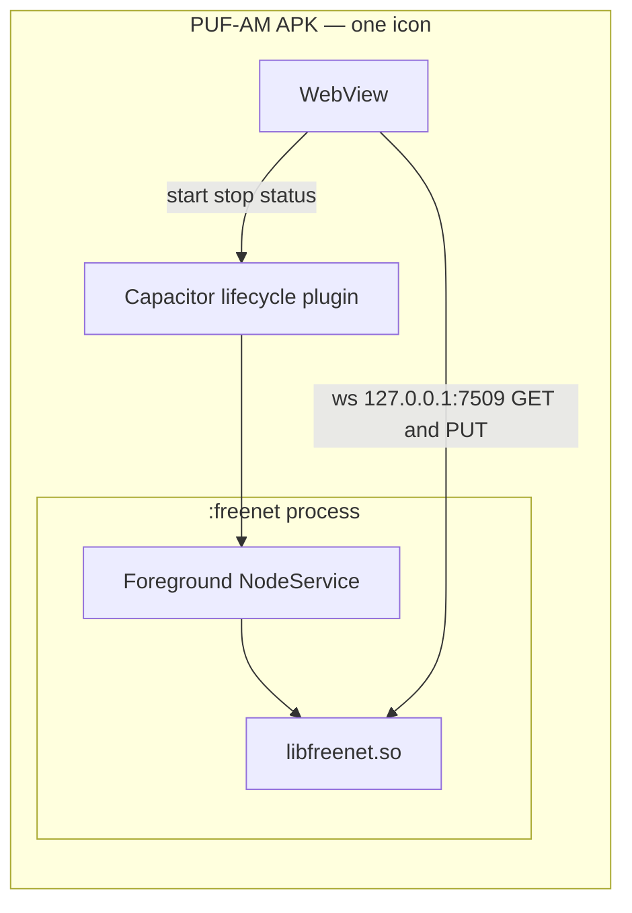

# APK Freenet host — network pack in the tablet APK

**Status:** Plan written 2026-08-14. Phase 1 (native PUT spike) started. Phases 2–5 not built.
**Experimental — not production.** Firebase Auth + invite PIN remains the shipping cloud path.
**Product:** PUF-AM · **Scope:** one APK that owns a Freenet node and can Join **and** Send.

Companion history (two-app reader, hub, gateway): [`APK_FREENET_PLUGIN.md`](APK_FREENET_PLUGIN.md). This file **reopens** that plan’s option C / §8 phase 4c.

Related: [`DESKTOP_FREENET_PLUGIN.md`](DESKTOP_FREENET_PLUGIN.md) · [`NAMING.md`](NAMING.md) · [`FREENET_HOLES.md`](FREENET_HOLES.md) hole 5 · [`CROP_PACK_PLUGIN.md`](CROP_PACK_PLUGIN.md)

---

## Frozen decisions

| # | Decision | Value |
|---|----------|-------|
| 1 | **Operator name** | **Network pack** — Settings → Plugins → Network & storage |
| 2 | **Code kind** | Stays `system` / id `freenet_host`. Not `crop_pack`. No zip Install / Activate / Delete |
| 3 | **How it ships** | Inside the Freenet APK flavor. Not a `plugins/` zip drop |
| 4 | **Process shape** | Same APK, **isolated** `android:process=":freenet"` + loopback WS. Not JNI in the WebView |
| 5 | **Interface** | `FreenetHostPlugin` (`start` / `stop` / `status` / put / get). Android is a new adapter |
| 6 | **AGPL** | Publish the Android host/fork. PUF-AM talks over WS — same carve-out as desktop §8.4 |
| 7 | **Milestone** | Join **and** Send from the tablet. Send is blocked on native PUT (no `fdev` in the APK) |
| 8 | **Storage** | Mobile `contribute_storage = false`. Ciphertext only. FarmCode stays the crypto boundary |
| 9 | **Small APK** | Keep `apk:debug:firebase` (~7.5 MB). Freenet flavor will be ~100 MB |

---

## What “network pack” is not

| | Network pack (Freenet) | Crop pack (walnut blight) |
|--|------------------------|---------------------------|
| Settings group | Network & storage | Crop tools |
| Code `kind` | `system` | `crop_pack` |
| Arrives | Ships in the app | Install / Activate |
| Day-to-day | Settings → Sync | Pack settings |

Never implement a crop pack as a Freenet unit, or the reverse.

---

## Why Send needs a spike first

[`publishFarmToFreenet`](../src/mist/mistFreenetClient.ts) POSTs Hot, bones, and the join slot through Express. A tablet has no Express. Desktop PUT uses `fdev` because `@freenetorg/freenet-stdlib` flatbuffers PUT hung on 0.2.11x.

Tablet Send and desktop “drop `fdev`” are **one** TypeScript PUT job. If the spike fails, ship Join-only (Phases 2–3) and leave Send on a laptop hub.

LAN ticket register stays optional (already try/catch). People on the sending tablet is that tablet’s shelf ([`FREENET_HOLES.md`](FREENET_HOLES.md) hole 3).

---

## Phases

### 1 — Native PUT spike (started 2026-08-14)

Prove pack-contract PUT (then slot PUT/UPDATE) over `ws://127.0.0.1:7509` **without `fdev`**.

| File | Job |
|------|-----|
| [`units/mist-freenet/src/freenet02-pack-id.ts`](../units/mist-freenet/src/freenet02-pack-id.ts) | Browser-safe instance id / parameters (no `node:fs`) |
| [`units/mist-freenet/src/freenet02-native-bincode.ts`](../units/mist-freenet/src/freenet02-native-bincode.ts) | `fdev` native bincode PUT frame (no `fdev` binary) |
| [`units/mist-freenet/src/freenet02-native-put.ts`](../units/mist-freenet/src/freenet02-native-put.ts) | Native WS PUT client + leftover stdlib `PutRequest` builder |
| [`units/mist-freenet/src/freenet02-native-slot.ts`](../units/mist-freenet/src/freenet02-native-slot.ts) | Slot PUT + UPDATE (`--as-state`) over the same native WS |
| [`units/mist-freenet/freenet02-native-put.test.ts`](../units/mist-freenet/freenet02-native-put.test.ts) | Hermetic: addressing + request shape |
| [`units/mist-freenet/freenet02-native-put-live.test.ts`](../units/mist-freenet/freenet02-native-put-live.test.ts) | Opt-in live put→get. Skip unless `FREENET_LIVE_WS=1` |
| [`units/mist-freenet/freenet02-native-slot.test.ts`](../units/mist-freenet/freenet02-native-slot.test.ts) | Hermetic: slot frames + PUFSLOT1 shape |
| [`units/mist-freenet/freenet02-native-slot-live.test.ts`](../units/mist-freenet/freenet02-native-slot-live.test.ts) | Opt-in live slot put→get and update. Skip unless `FREENET_LIVE_WS=1` |

Try against desktop pin **0.2.119** and, when a tablet node is up, **0.2.123**. If only the newer node answers, pin Android there and schedule the desktop bump separately.

Go/no-go: a unique blob PUT returns an `FN02@…` and GET returns the same bytes.

### 2 — Isolated host in the APK

New unit (`units/puf-freenet-host-android/` or `android/freenet-host/`): foreground `NodeService` in `:freenet`, JNI `cdylib`, WS on `127.0.0.1:7509`. Fork/adapt [freenet-android-node](https://github.com/manikmakki/freenet-android-node); publish that fork (AGPL). Capacitor plugin: start / stop / status only. Attach if `:7509` is already taken. Pin `libfreenet.so` like [`scripts/freenet-binaries.json`](../scripts/freenet-binaries.json). Mist off → do not start the node.

### 3 — Join without a second app

Existing GET client already talks to `:7509`. After `start()`, runtime is `android-local-node` with **our** node. Hardware: FarmCode + ticket join on SM-T545 with only PUF-AM installed.

### 4 — Send from the tablet

Wire native PUT into Hot / bones / slot publish when a local node can PUT (skip Express). Lift [`detectFreenetReadOnly`](../src/lib/freenetRuntime.ts). Local People rows for tickets this tablet minted. Hardware: tablet A Sends, tablet B Joins, no laptop — closes hole 5.

### 5 — Operator copy

How this works + Send card: a tablet can Send. Laptop / farm gateway stay the durability anchor.

---

## Out of scope

Crop-pack Install for Freenet · JNI in the WebView · `fdev` in the APK · Play Store / `com.sentinut.farm` rename · auto-publish on create · fake revoke-as-kick · requiring the companion app on the Freenet APK flavor (attach if present).

---

## Spike log

| Date | Against | Result |
|------|---------|--------|
| 2026-08-15 | Hermetic tests | Pass — addressing + PutRequest packs (empty `RelatedContractsT` is required) |
| 2026-08-15 | Live stdlib PUT · node **0.2.125** on `:7509` | **NO-GO.** Request encodes and is sent. SDK `Request timeout` at 30s. Journal shows no put. Same node: **`fdev` PUT succeeded in 1.5s** (`VUsGp8KZV6J9cPELymfHtXddAHQRRodRWZsH4KEmvpT`). Flatbuffers PUT is still the hang; native WS encoding (what `fdev` speaks) is the next spike, or an upstream SDK fix |
| 2026-08-15 | Native bincode PUT · node **0.2.125** on `:7509` | **GO.** `encodingProtocol=native` + bincode `ClientRequest::Put` (stdlib 0.8.5 / fdev 0.3.287 fixture). Live put→get in **1.2s**, same bytes back. Packaged WASM header is stripped before send. Slot PUT/UPDATE is the remaining Phase 1 piece before wiring Send |
| 2026-08-15 | Native slot PUT/UPDATE · node **0.2.125** on `:7509` | **GO.** First publish + GET in ~3s. Re-publish via `UpdateData::State` with the **real** code hash (a zero hash, which is what `fdev` sends, came back `missing contract`). This node also accepts a second PUT as an upsert, so the already-published fallback may not run. |

**Implication:** pack and slot publish no longer need `fdev` on the wire. Wiring `BrowserFreenetPutClient` / `BrowserFreenetSlotClient` into `publishFarmToFreenet` is Phase 4. Phases 2–3 (isolated node + Join) can proceed in parallel.
