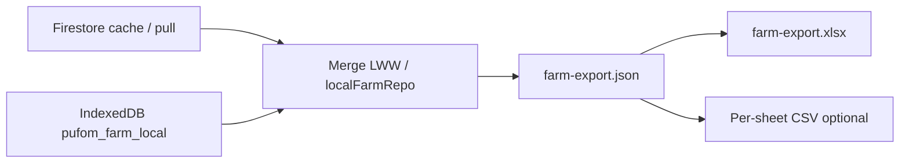

# Farm export — `farm-export.json` → xlsx (sketch)

**Status:** v1 implemented (Settings → Offline & sync + Diary JSON/Excel buttons)  
**Product:** PUF-AM (Ag Manager) — local folder may be `Walnut_farm_manager`  
**Naming:** [`NAMING.md`](NAMING.md) § Export formats (distinct from `.pufom` / `PUFOM1`)  
**Audience:** Production Firebase path first; mist fork consumes the same record shape later.

---

## 1. Goals and non-goals

### Goals (v1)

- **Human-readable JSON** snapshot of operational records a farmer can archive, email, or open in Excel.
- **Diary first:** all `DiaryEvent` rows from local IndexedDB (`pufom_farm_local` → `diary`) merged with whatever is already cached from Firestore (same merge path as `buildPufomBundle` / `farmDiary.loadData`).
- **Field issues:** open/active `FieldIssue` rows (`issues`) plus optional **`issuesArchive`** (`issues_archive` in IndexedDB / `archived_issues` in Firestore).
- **Spreadsheet-friendly:** top-level arrays of flat records; one xlsx sheet per array.
- **Canonical file:** always emit **`farm-export.json`** (pretty-printed UTF-8). xlsx is a **derived** format, never the source of truth.
- **Production path:** Firebase + local-first IndexedDB — same data operators see in Diary and Field Ops. Not mist-only.

### Non-goals (v1)

- **Geometry** (blocks, pins, tracks in `sentinut_farm_geometry`) — optional **phase 2**; GeoJSON-in-JSON does not flatten cleanly to one sheet; keep in `.pufom` or a separate `geometry-export.json` later.
- **Replacing `.pufom`** — gzip sync bundle (`PUFOM1`, LWW merge, LAN shelf) stays the device-to-device path (`OfflineSyncCard`, `pufomSync.ts`).
- **Photo binaries in JSON/xlsx** — no base64 or hi-res in the main package; optional compressed **`photos/` sidecar zip** (§2.4). Hi-res on-device / **Reticulum** transfer is out of scope for farm-export.
- **Full-farm admin export** — Farm Management “Export Data” placeholder is out of scope until diary/issues path is proven.
- **Import / round-trip** — v1 is export-only; import remains `.pufom` or future dedicated importer.
- **Mist Hot/Archive wiring** — documented as future consumer of the same record arrays; no seal/cron work here.

---

## 2. `farm-export.json` schema sketch

### Envelope

```json
{
  "format": "farm-export",
  "v": 1,
  "exportedAt": "2026-08-03T00:00:00.000Z",
  "farmId": "uuid-or-slug",
  "farmName": "Clare Downs",
  "source": "local",
  "exportScope": {
    "diary": "all",
    "issues": true,
    "issuesArchive": true
  },
  "diary": [],
  "issues": [],
  "issuesArchive": []
}
```

| Field | Type | Notes |
|-------|------|--------|
| `format` | `"farm-export"` | Wire discriminator (distinct from `.pufom` / `PUFOM1`). |
| `v` | `1` | Schema version; bump when breaking column/field renames. |
| `exportedAt` | ISO-8601 UTC | Same semantics as `PufomBundleV1.exportedAt`. |
| `farmId` | string | Required. |
| `farmName` | string? | From `FarmSettings.farmName` / auth context when available. |
| `source` | `"firebase"` \| `"local"` \| `"mist"` | How the snapshot was assembled (`local` = IndexedDB + cached merge; `firebase` = cloud pull completed; `mist` = future Hot/Archive adapter). |
| `exportScope` | object? | Filter metadata. **Default:** `diary: "all"` (every local row); optional future partial exports may add date windows. |
| `diary` | `DiaryEvent[]` | See §2.1. |
| `issues` | `FieldIssue[]` | Active/open issues (`status !== 'archived'` in UI store). |
| `issuesArchive` | `FieldIssue[]` | Archived issues only; omit key or `[]` when not requested. |

**Filename convention:** `{farmNameOrId}_{YYYY-MM-DD}_farm-export.json` (mirror `.pufom` date stamp pattern).

### 2.1 `DiaryEvent` (from `src/lib/farmDiary.ts`)

Export **all scalar fields** present on the type; omit keys whose value is `undefined` (match Firestore `issueForFirestore` hygiene).

```typescript
// Reference — do not duplicate in export doc long-term; link to farmDiary.ts
interface DiaryEvent {
  id: string;
  date: string;                    // YYYY-MM-DD
  type: 'spray' | 'irrigation' | 'work' | 'nutrition';
  status?: 'planned' | 'done' | 'cancelled';
  blockId?: string;
  blockName?: string;              // derived at export from geometry cache; omit when unresolved
  sprayType?: 'chem' | 'bio' | 'both';
  applicationMethod?: 'ground' | 'drone' | 'helicopter' | 'aeroplane';
  agentName?: string;
  carrier?: string;
  adjuvant?: string;
  irrigationAmount?: number;
  durationMinutes?: number;
  notes?: string;
  productName?: string;
  rate?: number;
  rateUnit?: 'kg/ha' | 'L/ha' | 'kg' | 'L';
  nRate?: number;
  pRate?: number;
  kRate?: number;
  nutritionMethod?: 'broadcast' | 'fertigation' | 'foliar' | 'banding';
  title?: string;
  assignedTo?: string;
  assignedToName?: string;
  priority?: 'low' | 'medium' | 'high';
  safetyChecklistAccepted?: boolean;
  acceptedAt?: string;
  completedAt?: string;
  linkedIssueId?: string;
  updatedAt?: string;
}
```

**Nested-field strategy (diary):** All fields are already flat scalars — no JSON-string columns needed in v1. **Block resolution (locked):** when `blockId` is set, export resolves display name from the local geometry cache and emits **`blockName`** alongside **`blockId`** in JSON rows and xlsx columns. Optional **derived columns** at xlsx layer only (not stored in JSON): `npkSummary` = `N{nRate} P{pRate} K{kRate}` (same as existing CSV export in `FarmDiary.tsx`).

### 2.2 `FieldIssue` (from `src/lib/fieldStore.ts`)

```typescript
interface FieldIssue {
  id: string;
  lat: number;
  lng: number;
  category: 'irrigation' | 'pest' | 'disease' | 'damage' | 'other';
  priority: 'low' | 'medium' | 'high';
  note?: string;
  photoData?: string;   // base64 — see below
  photoUrl?: string;
  status: 'open' | 'in-progress' | 'resolved' | 'archived';
  isMistake?: boolean;
  reportedBy: string;
  reportedAt: string;
  resolvedAt?: string;
  archivedAt?: string;
  archivedBy?: string;
  updatedAt?: string;
}
```

**Nested-field strategy (issues):**

| Field | JSON export | xlsx column |
|-------|-------------|-------------|
| `photoData` | **Omit** | `hasPhoto` boolean; never embed base64 in cells |
| `photoUrl` | Include if set (reference only) | `photoUrl` |
| `hasPhoto` | derived: `!!photoUrl \|\| !!photoData` | `hasPhoto` |
| All other fields | Flat columns | 1:1 |

**Photos (locked):** No high-res binaries in `farm-export.json` or xlsx. Records-only export emits **`photoUrl`** / **`hasPhoto`**; compressed images go in an optional **sidecar zip** (see §2.4). Full-resolution images stay on-device and are out of scope for this path (future **Reticulum** transfer — not farm-export xlsx/json).

Archive uses a **separate sheet** (`IssuesArchive`) with the same base columns as `Issues`, plus `archivedAt`, `archivedBy`, `status` (= `archived`). No merged sheet with `isArchived`.

### 2.4 Photo sidecar (records-only, optional)

When the user opts in to issue photos, emit a **sidecar archive after compression** alongside the JSON (or bundled in one zip):

```
farm-export.zip
├── farm-export.json
└── photos/
    ├── {issueId}.jpg
    └── ...
```

- **Filenames:** `{issueId}.jpg` (or `.webp`) keyed by issue `id`; skip rows with no local thumbnail/blob.
- **Compression:** resize to a **soft max dimension** (e.g. 1280 px long edge) and quality (e.g. JPEG 80) — records-only, not hi-res.
- **Standalone layout:** same `photos/` folder may ship next to a loose `farm-export.json` without wrapping zip when the share target prefers separate files.
- **Not included:** original camera resolution, base64 in JSON, or images embedded in xlsx cells.
- **Out of scope here:** hi-res on-device retention and **Reticulum** peer transfer — separate from farm-export.

### 2.5 Phase 2 (not v1): geometry pointer

When added, either:

- sibling file `farm-export-geometry.json` with `blocks` / `pins` / `tracks` arrays, or
- envelope key `geometry` with `updatedAt` + entity arrays from `FarmGeometryBundle`.

GeoJSON coordinates stay nested in JSON; xlsx would get summary sheets (block id, name, area ha) not full WKT unless explicitly requested.

---

## 3. Sheet mapping (JSON array → xlsx sheet)

One workbook **`{farmNameOrId}_{date}_farm-export.xlsx`**, sheets:

### Sheet: `Diary`

| Column | Source field | Notes |
|--------|--------------|--------|
| `id` | `id` | UUID |
| `date` | `date` | YYYY-MM-DD |
| `type` | `type` | spray / irrigation / work / nutrition |
| `status` | `status` | Default display: work → `planned`, else `done` if missing |
| `blockId` | `blockId` | Empty = farm-wide |
| `blockName` | `blockName` | Resolved display name; empty when `blockId` unset or unknown |
| `title` | `title` | Work plans |
| `productName` | `productName` | Nutrition |
| `agentName` | `agentName` | Spray |
| `sprayType` | `sprayType` | chem / bio / both |
| `applicationMethod` | `applicationMethod` | |
| `carrier` | `carrier` | |
| `adjuvant` | `adjuvant` | |
| `irrigationAmount` | `irrigationAmount` | MM |
| `durationMinutes` | `durationMinutes` | |
| `rate` | `rate` | Numeric |
| `rateUnit` | `rateUnit` | |
| `nRate` | `nRate` | |
| `pRate` | `pRate` | |
| `kRate` | `kRate` | |
| `nutritionMethod` | `nutritionMethod` | |
| `assignedTo` | `assignedTo` | UID |
| `assignedToName` | `assignedToName` | Display |
| `priority` | `priority` | Work |
| `safetyChecklistAccepted` | `safetyChecklistAccepted` | TRUE/FALSE |
| `acceptedAt` | `acceptedAt` | ISO |
| `completedAt` | `completedAt` | ISO |
| `linkedIssueId` | `linkedIssueId` | Cross-ref to Issues sheet |
| `notes` | `notes` | Free text |
| `updatedAt` | `updatedAt` | LWW stamp |

**Sort:** `date` desc, then `type`, then `id`.

### Sheet: `Issues`

| Column | Source field |
|--------|--------------|
| `id` | `id` |
| `lat` | `lat` |
| `lng` | `lng` |
| `category` | `category` |
| `priority` | `priority` |
| `status` | `status` |
| `note` | `note` |
| `hasPhoto` | derived: `!!photoUrl \|\| !!photoData` |
| `photoUrl` | `photoUrl` |
| `isMistake` | `isMistake` |
| `reportedBy` | `reportedBy` |
| `reportedAt` | `reportedAt` |
| `resolvedAt` | `resolvedAt` |
| `updatedAt` | `updatedAt` |

### Sheet: `IssuesArchive`

Same columns as `Issues`, plus:

| Column | Source field |
|--------|--------------|
| `archivedAt` | `archivedAt` |
| `archivedBy` | `archivedBy` |

Omit sheet entirely when `issuesArchive` array is empty and user did not request archive.

### Sheet: `_Meta` (optional, recommended)

Key-value pairs: `format`, `v`, `exportedAt`, `farmId`, `farmName`, `source`, serialized `exportScope`, row counts per array. Helps auditors without opening JSON.

---

## 4. Conversion path



1. **Build JSON** (always): read `listLocalEntities(farmId, 'diary'|'issues'|'issues_archive')`; optionally refresh from Firestore when online (same as diary load); **include all local diary rows** (no default 90-day window); resolve `blockId` → `blockName` from geometry cache; `JSON.stringify(obj, null, 2)` → download or share. Optional **photo sidecar zip** (§2.4) when user requests issue photos.
2. **JSON → xlsx** (derived):
   - **Preferred:** reuse existing **`xlsx`** dependency (`package.json`) — already used for nutrition uploads; add a small `jsonToFarmExportXlsx()` helper. Accept documented audit risk (`Plans/AUDIT_LOG.md`) or migrate to **SheetJS CE** when nutrition parser moves.
   - **Alternative:** **exceljs** if multi-sheet styling or row limits matter later (heavier bundle).
   - **Offline script:** Node CLI `scripts/farm-export-to-xlsx.mjs farm-export.json` for workshop / accountant workflows (no browser).
3. **CSV:** Diary already has **client CSV** (`FarmDiary.handleExport`) with a **narrower** column set. Keep it for quick diary-only dumps; full farm export CSV = export each sheet as `{name}.csv` or zip — not required for v1 if xlsx works.
4. **Compression:** JSON stays **uncompressed** for inspectability. Optional `.json.gz` for email size — not v1.

**Relationship to `.pufom`:** `buildPufomBundle()` already gathers the same entity kinds + geometry. Implementation may share a **`collectFarmOperationalEntities(farmId)`** internal helper; `farm-export.json` is the **un-gzipped, geometry-free, human-facing** slice. Do not teach Excel users to rename `.pufom`.

---

## 5. Where it lives in the app (later)

| Entry point | Behaviour |
|-------------|-----------|
| **Settings → Offline / Data** (`OfflineSyncCard` area) | “Export farm data (JSON)” + secondary “Download Excel workbook” — sits beside existing Export `.pufom` / Import `.pufom`. |
| **Diary → export menu** | “Export JSON (full diary)” exports **all local diary rows**; optional checkbox “Include field issues”. |
| **Not here** | Farm Management “Data Governance” stub — wire after v1 proven. |

Export does **not** flush outbox or mutate stores. Pending cloud ops remain visible via existing sync pending counts.

---

## 6. Relation to mist (pointer only)

[`Plans/MIST_NETWORK_STORAGE.md`](MIST_NETWORK_STORAGE.md) defines **Hot** (≈90-day rolling) and **Archive** (sealed yearly) record bags with `{ id, type, ts, payload }` wrappers.

**Intent:** When mist diary path ships, **Hot merge** and **Archive seal** should read/write **`DiaryEvent` / `FieldIssue` objects compatible with this export** — i.e. `payload` in mist records = same shape as rows in `farm-export.json` arrays, and a mist export adapter sets `source: "mist"`.

No implementation in mist units until production export helper exists and field names are frozen here.

---

## 7. Decisions locked

| Topic | Decision |
|-------|----------|
| **Diary range** | Export **all local diary rows** — no default 90-day window (`getDefaultDiaryStartDate(90)` is UI load only, not export scope). |
| **Issue photos** | **Sidecar zip after compression** for records-only (`farm-export.json` + `photos/{issueId}.jpg`, or single `farm-export.zip`). JSON/xlsx carry `photoUrl` / `hasPhoto` only — no base64, no hi-res in the export package. Hi-res stays on-device; **Reticulum** handles full-res transfer later (out of farm-export path). |
| **Block names** | **Resolve display names** at export: emit **`blockId`** and **`blockName`** in JSON diary rows and xlsx `Diary` sheet columns (from local geometry cache). |
| **Issues archive layout** | **Two sheets:** `Issues` + `IssuesArchive` (mirrors Field Ops / IndexedDB split). No single merged sheet with `isArchived`. |

---

## 8. Implementation checklist (post-approval)

- [x] `collectFarmExportBundle(farmId, scope)` → envelope object (diary: all local rows; blockName resolution) — `src/lib/farmExport.ts` (`buildFarmExportJson`)
- [x] Download JSON from Settings + Diary
- [x] `farmExportToXlsx(bundle)` using `xlsx` (`Issues` + `IssuesArchive` sheets)
- [x] Optional photo sidecar zip (`photos/{issueId}.jpg`, compressed)
- [ ] Workshop Node script for JSON → xlsx
- [x] Tests: golden JSON fixture + column header snapshot — `tests/farmExport.test.ts`
- [ ] Phase 2: geometry export spec

---

## References

| Artifact | Path |
|----------|------|
| Naming (export vs sync) | [`Plans/NAMING.md`](NAMING.md) §6 |
| `DiaryEvent` type | `src/lib/farmDiary.ts` |
| `FieldIssue` type | `src/lib/fieldStore.ts` |
| Local entity store | `src/lib/localFarmRepo.ts` (`pufom_farm_local`) |
| Sync bundle (parallel) | `src/lib/pufomSync.ts`, `shared/sync/pufomBundle.ts` |
| Existing diary CSV | `src/pages/FarmDiary.tsx` (`handleExport`) |
| Geometry IDB | `src/lib/farmGeometryIdb.ts` (`sentinut_farm_geometry`) |
