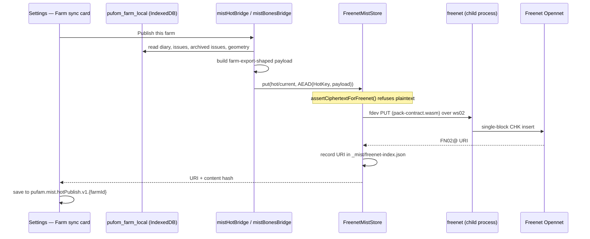
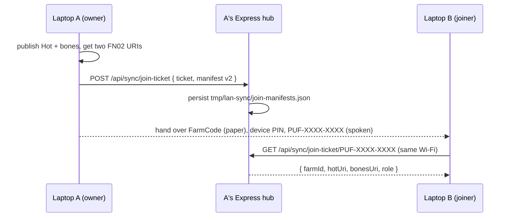
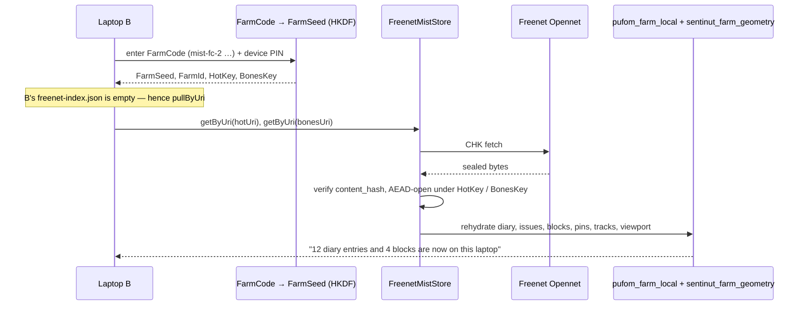

# How PUF-AM contributes to and communicates over Freenet

**Status:** Description of what is built as of ~2026-08-05, not a proposal. Field-validated on two Fedora laptops over Opennet (~2026-08-04).
**Date:** 2026-08-05
**Product:** PUF-AM (Ag Manager)
**Experimental:** the mist/Freenet path is experimental. **Firebase Auth + invite PIN remains the shipping cloud path.**

This document answers three questions that keep getting conflated: what PUF-AM *puts on* Freenet, what it *keeps locally* to make that work, and what is **not** on Freenet at all.

Related: [`MIST_NETWORK_STORAGE.md`](MIST_NETWORK_STORAGE.md) (crypto, FarmCode, Hot/Archive design) · [`DESKTOP_FREENET_PLUGIN.md`](DESKTOP_FREENET_PLUGIN.md) (the node lifecycle) · [`APK_FREENET_PLUGIN.md`](APK_FREENET_PLUGIN.md) (why tablets are out) · [`LOCAL_DATA_STORAGE.md`](LOCAL_DATA_STORAGE.md) (the full local inventory) · [`NAMING.md`](NAMING.md) §7.

---

## 1. Contribute versus communicate

These are two different opt-ins and they are routinely mistaken for one another. **PUF-AM communicates today; it does not meaningfully contribute.**

| | **Communicate** | **Contribute** |
|--|-----------------|----------------|
| What it is | Publishing *this farm's* sealed records and fetching them back on another device | Hosting and replicating other peers' encrypted contracts for network durability |
| Flag | none — it is what the mist path does | `contribute_storage` |
| Default | on, when the operator opts into mist | **`false` everywhere in this repo** |
| Where set | — | `FreenetPeer` / `MistStore` constructor option, persisted per store |
| Effect in code | `put` / `get` through the transport | Insert priority and redundancy only (see below) |

### What `contribute_storage` actually does today

Honesty matters here, because the name promises more than the code delivers.

| Layer | Behaviour when `contribute = true` |
|-------|-----------------------------------|
| `FcpFreenetTransport.putBlob` | Raises insert effort: `MaxRetries` 3 → 10, `PriorityClass` 6 → 2, `ExtraInsertsSingleBlock` 0 → 2 |
| `DiskMistStore` / `IndexedDbMistStore` | Persists the flag and reports it in `health()` / `stats()`; a disk budget (`maxBytes`, default 512 MiB) exists to bound it |
| Foreign replication | **Not implemented.** `disk-mist-store.ts` says so in its header — a future `replicate()` is what would refuse inbound copies when the flag is false |

So `contribute_storage = true` currently means *"try harder to make my own inserts stick"*, not *"host other farms' data"*. The plumbing, the policy, and the resource caps are in place ahead of the behaviour, deliberately: the frozen mobile peer policy had to exist before anyone could switch it on by accident.

**Every call site in the app passes `contribute: false`** — `startFreenetPeer({ contribute: false })` in both mist cards. Real durability contribution comes from the Freenet node itself, which stores what the network routes to it, not from this flag.

### Who should contribute, once it means something

Frozen in [`MIST_NETWORK_STORAGE.md`](MIST_NETWORK_STORAGE.md) § Mobile peer policy:

| Class | Default | Note |
|-------|---------|------|
| Phone / tablet | **`false`** | And `allow_mobile_contribute` must be set by an admin before a device may even opt in. Moot today — tablets have no node at all ([`APK_FREENET_PLUGIN.md`](APK_FREENET_PLUGIN.md)) |
| Desktop / shed pin / always-on hub | **`true`** recommended | The intended durability anchor: mains power, unmetered link, real disk |

---

## 2. What PUF-AM publishes

Three payload kinds reach Freenet today. All three are **AEAD-sealed before insert** (§4), and all three are KiB-class single-block CHK — no splitfiles (frozen decision, MIST § Pre-Freenet workshop decisions #2).

| Payload | MistStore key | Contents | Published when |
|---------|---------------|----------|----------------|
| **Hot** | `mist/v1/farm/{farmId}/hot/current` | Rolling window of diary events, field issues, archived issues — farm-export-shaped, mirrored from `pufom_farm_local` by [`src/mist/mistHotBridge.ts`](../src/mist/mistHotBridge.ts) | Operator presses **Send this farm**; auto-mirrored locally on each save while a mist session is unlocked |
| **Bones** | `mist/v1/farm/{farmId}/bones/{assetId}` | Farm structure: block boundaries, pins, tracks, saved viewport — [`src/mist/bonesGeometry.ts`](../src/mist/bonesGeometry.ts) | Same publish action |
| **Join manifest** | not a mist key — a LAN shelf entry | `{ v: 2, farmId, hotUri, bonesUri, role, permissions?, expires?, ticket }` — resolves a short `PUF-XXXX-XXXX` ticket to the two FN02 URIs | When a short join ticket is minted |

**The join manifest is the one that is *not* on Freenet.** It lives on the owner's LAN hub (`tmp/lan-sync/join-manifests.json`, routes under `/api/sync/join-ticket`) because pack-contract URIs are immutable: there is no mutable Freenet slot to update with "the current Hot for this farm", so a short ticket has to be resolved somewhere the owner controls. That is why joining still needs the owner's Wi-Fi. A mutable Freenet contract is what lifts that restriction, and it is Option B in [`MIST_TWO_FEDORA_FREENET.md`](MIST_TWO_FEDORA_FREENET.md).

**Not yet published:** Archive contracts and the Manifest. `sealHotPeriod()` exists and the shapes are designed ([`MIST_NETWORK_STORAGE.md`](MIST_NETWORK_STORAGE.md) § Hot → Archive seal lifecycle), but nothing triggers a seal-and-publish. Everything currently rides in Hot.

---

## 3. Data flow

### 3.1 Publish Hot and bones (laptop A)

If the node is down, `put` queues in `_mist/freenet-outbox.json` and flushes on the next connect — the store reports outbox depth in `stats()`.

### 3.2 Mint and resolve a join ticket (LAN)

The ticket says *where* the farm is; the FarmCode is what decrypts it. A ticket alone grants nothing ([`NAMING.md`](NAMING.md) §7).

### 3.3 Pull a farm onto a new device (laptop B)

---

## 4. What is encrypted before upload

**Everything.** Freenet's CHK is content-addressing and transport; it is not farm confidentiality. Sealing happens in `mist-freenet` before the transport is ever handed bytes.

| Step | Where |
|------|-------|
| `FarmSeed = HKDF(FarmCode_bytes, salt "pufam-mist-v1", info "farm-seed")` | `farm-seed.ts` |
| `HotKey = HKDF(FarmSeed, "freenet-hot")`, `BonesKey = HKDF(FarmSeed, "freenet-bones")` | `freenet-keys.ts` |
| AEAD seal of the payload under the contract key | `hot-crypto.ts`, `bones-crypto.ts` |
| **Guard:** `assertCiphertextForFreenet()` refuses a plaintext-looking buffer in `FreenetMistStore.put()` | `ciphertext-guard.ts` |
| Host contract: `putCiphertext` / `getCiphertext` only — the host never holds farm keys | `units/puf-freenet-host/src/types.ts` |

The guard is the load-bearing part. "Encrypt before upload" as a rule in a document is a rule someone eventually forgets; as a throw inside `put()` it is a rule that fails the test suite. Tests may bypass it only through the explicit `allowPlaintextForTests` option.

What an observer of the Freenet network can see: that a KiB-class block exists at some CHK. Not the farm, not the owner, not the record count. What a **hub** relaying for a tablet would see (§ [`APK_FREENET_PLUGIN.md`](APK_FREENET_PLUGIN.md) §4) is the same — sealed bytes it cannot read.

---

## 5. What is NOT on Freenet

| Not published | Why | Where it lives instead |
|---------------|-----|------------------------|
| **Everything in a Firebase farm** | Different backend entirely. Mist is opt-in per device (`pufam.farmStoreBackend`) | Firestore |
| **Issue photos** | Blobs, not KiB-class; no splitfile path in v1 | `pufom_photo_outbox` IDB → Firebase Storage |
| **Basemap / Esri tile packs** | Tens of MB; bones design names them as a later splitfile case | `sentinut_basemap` IDB, device transfer ([`OFFLINE_MAP_APK.md`](OFFLINE_MAP_APK.md)) |
| **Weather cache** | Derived from DPIRD; re-fetchable, farm-independent | `pufom_weather_cache` IDB |
| **Crew presence / live GPS** | Ephemeral by design — Reticulum telemetry, never Freenet | Firestore `presence/`, LAN presence routes |
| **Archive contracts and the Manifest** | Designed, sealer exists, no publish trigger yet | Local only; all records still ride in Hot |
| **The join manifest** | Immutable URIs mean the ticket must resolve somewhere mutable | Owner's LAN shelf (§2) |
| **Invite index** | Admin-device ledger; mist mirror is explicitly optional and deferred | Local encrypted store |
| **FarmCode, FarmSeed, device keys** | Recovery root and key material. Publishing them would end the design | Paper wallet; `pufam.mist.*` session keys on device |
| **`.pufom` LAN sync bundles** | A different transport for the same data | LAN / USB |
| **Reticulum traffic** | Separate plane; telemetry is never mirrored to Freenet | Mesh only (unit not built) |

---

## 6. Where Freenet-related state is kept locally

Full inventory in [`LOCAL_DATA_STORAGE.md`](LOCAL_DATA_STORAGE.md); this is the Freenet-relevant subset.

### Browser / WebView

| Store | Kind | Contents |
|-------|------|----------|
| `pufam-mist-v1` | IndexedDB — `entries`, `state` | `IndexedDbMistStore`: sealed mist entries by `mist/v1/...` key, plus the persisted `contribute` flag |
| `pufam.mist.session.v1`, `.sessionMeta.v1`, `.deviceKey` | localStorage | Mist device session and device key material |
| `pufam.mist.hotPublish.v1.{farmId}` | localStorage | Last Hot publish: content hash, counts, **`freenetUri`** (FN02), bones URI, minted join ticket + role + expiry |
| `pufam.mist.bonesPublish.v1.{farmId}` | localStorage | Same for the geometry bones publish |
| `pufam.farmStoreBackend` | localStorage | `firebase` \| `mist` — which backend this device uses |

### Node side (server or Electron main)

Rooted at `MIST_FREENET_ROOT`, which the desktop sets to `<userData>/mist-freenet` at boot; the dev server falls back to `<cwd>/tmp/mist-freenet`.

| Path | Contents |
|------|----------|
| `<root>/_mist/freenet-index.json` | Local map of mist key → FN02 URI + content hash. **Per device** — B's is empty after a FarmCode recovery, which is exactly why the pull path is `pullByUri` |
| `<root>/_mist/freenet-outbox.json` | Inserts queued while the node was down; flushed on connect |
| `<root>/blobs/`, `<root>/index.json`, `<root>/state.json` | `DiskMistStore` cache, entry index, and the persisted `contribute` / `maxBytes` state |
| `tmp/lan-sync/join-manifests.json` | The LAN join-ticket shelf (owner's hub only) |

### Desktop app-owned (Electron `userData`)

`~/.config/PUF-AM/` on Fedora, `%APPDATA%\PUF-AM\` on Windows.

| Path | Contents |
|------|----------|
| `desktop-prefs.json` | `{ mistEnabled }` — the launch opt-in, read before any window exists |
| `freenet/config/`, `freenet/data/`, `freenet/logs/` | The app-owned node's own state, including its **peer identity**. Deliberately not `~/.local/share/freenet`, which is why run 1 is a fresh Opennet peer |
| `mist-freenet/` | `MIST_FREENET_ROOT` — the paths in the table above |

### Shipped, read-only

| Path | Contents |
|------|----------|
| `resources/freenet/{freenet,fdev,LICENSE.md}` | The pinned 0.2.119 binaries |
| `resources/contracts/pack-contract.wasm` | Code hash `5Piu7V1PjjcPVnTvUbyMdDiyvwoBprBPZ4GFUHfabyzW`, pinned in `freenet02-pack.ts`. Outside the asar because `fdev --code` needs a real filesystem path |

### Android

**Nothing Freenet-specific.** The APK has the browser stores above and no node, no `MIST_FREENET_ROOT`, no binaries — see [`APK_FREENET_PLUGIN.md`](APK_FREENET_PLUGIN.md).

---

## 7. Authoritative versus cache

| Data | Authoritative | Freenet's role |
|------|---------------|----------------|
| Diary, issues, geometry on a mist farm | **The local device** (`pufom_farm_local`, `sentinut_farm_geometry`) | Durable copy + transfer between machines |
| Farm bones | **Local cache**, for UI and offline | Durable home; pulled on join or `map_version` change |
| FarmCode | **Paper** | Never published |
| FN02 URIs | `pufam.mist.hotPublish.v1.*` + `freenet-index.json` — both per device | The URIs *are* the addresses; losing them locally means needing a join ticket |

The rule this keeps landing on: **Freenet is not the source of truth for a running farm.** It is durability plus a transfer mechanism between peers, and the operator's laptop is what the paddock actually runs on. Multi-year survival is local caches + offline backups + at least one always-on pin — not the mist network by itself.
