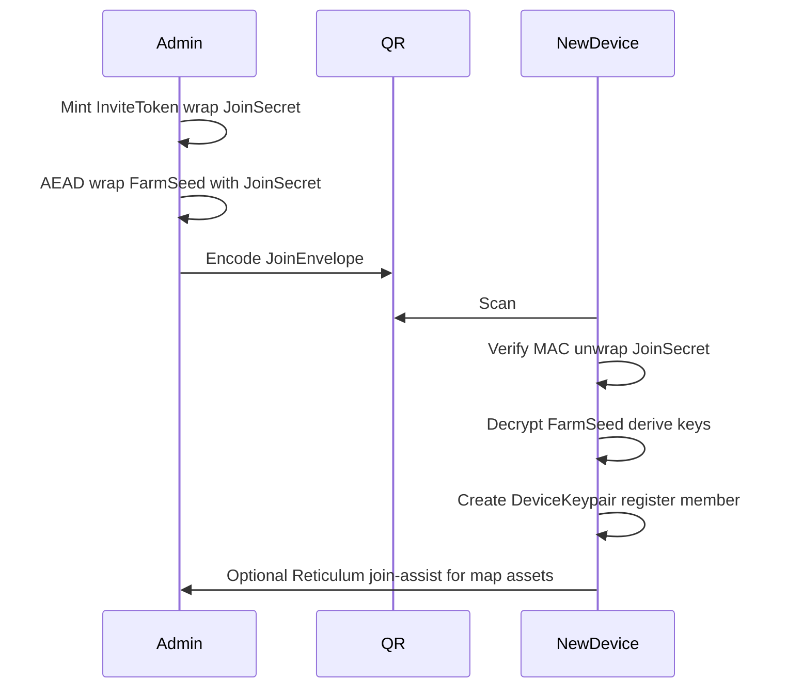

# Mist network & storage (experimental fork)

**Status:** Design workshop — **not** the production path. Pre-Freenet two-laptop FarmCode recovery **succeeded** (~2026-08-03); pre-Freenet workshop decisions **frozen** (~2026-08-03). Cross-device Hot/bones sync and live Freenet wiring **not started**.  
**Date:** 2026-08-02 (milestone + workshop update 2026-08-03)  
**Product:** PUF-AM (Ag Manager)

**Naming:** [`NAMING.md`](NAMING.md) §7 (mist paths, FarmCode, `pufam-mist-v1` IDB) — product/storage glossary not repeated here.

Firebase Auth + invite PINs + Firestore remain the **working production stack**. Mist work must land as an **experimental fork** (branch / feature flag / separate package path) so it cannot break PIN login or Cloud Run hosting.

Authoritative short pointer: [`DEVELOPER_NOTES.md`](../DEVELOPER_NOTES.md) § Mist (experimental).

---

## Vision (“mist”, not cloud)

Users download APK / web / Windows–Linux EXE (macOS later). After setup the farm is **fully offline-capable**: local ESRI/basemap packs, boundaries, features, diary/records. No email registration — **name + invite token**; the farm owner holds a **one-time FarmCode** (paper wallet) used **only for recovery and ownership**, not day-to-day login.

Connectivity and durability layers:

| Plane | Role |
|-------|------|
| **Local-first** | Authoritative day-to-day copy on each terminal |
| **Reticulum** | On-farm mesh (LoRa RNodes / multi-hop): telemetry, temp messages, map heads-up + asset pull — no Wi‑Fi infrastructure required |
| **Freenet-style mist** | Encrypted, compressed, fragmented durable **records** across opt-in peers worldwide |
| **Offline backups** | Automated encrypted exports (USB/NAS/user cloud) — real multi-year insurance |

Anyone running the app *may* host opaque encrypted fragments. Preferential replication to the farm’s own members and optional shed/Pi pins. No subscriptions; no central operator required for core operation.

---

## Data placement (locked workshop decisions)

| Data | Primary home | Signal / sync |
|------|----------------|---------------|
| Live telemetry, personnel movement, temporary messages | — | **Reticulum only** |
| **Farm bones** — boundaries, infrastructure, static map features, tile packs | **Mist** (durable home) + **local cache** (authoritative for UI) | Reticulum heads-up + optional Resource handoff; version + `content_hash` |
| Diary, records, plans (recent) | Local cache + **Freenet Hot contract** | Freenet sync |
| Older diary/records/plans | Local cache (user retention) + **Freenet Archive contracts** | Manifest → on-demand pull |
| Full restore | Mist + any member’s local copy + offline backup | Slow path — acceptable |

### Farm bones (boundaries & structure)

**Farm bones** are the larger, slower-changing farm structure: boundary polygons, infrastructure layers, static map features, and offline tile/basemap packs. They are **not** day-to-day diary/ops records.

| Layer | Role |
|-------|------|
| **Local cache** | Authoritative for UI rendering and offline operation on each terminal |
| **Mist** | Durable encrypted home — bones are published/versioned here so new members/devices and full restores can pull them without depending on a single peer |
| **Reticulum** | Change announce (`map_update` heads-up) + optional fast Resource handoff between on-farm peers — **not** the sole home of bones |

**When mist is consulted for bones:**

- A **new member or device** joins and needs the current farm structure.
- **Structure changes** — authorised edit bumps `map_version`, publishes new bones to mist, and announces via Reticulum.

Each bones asset carries **`map_version`** (monotonic) and **`content_hash`** (SHA-256 of sealed bytes). Terminals compare hashes before re-downloading — unchanged geometry is not re-fetched. Mobile devices **pull on demand** from mist without enabling `contribute_storage` (see **§ Mobile peer policy**).

Reticulum remains the low-latency on-farm path: peers that already have current bones can satisfy Resource pulls immediately; mist is the fallback and durability anchor when no local peer is available.

### Freenet shape: hot + archive + manifest

Freenet replicates each **contract** across peers; it does **not** automatically split one logical archive into many contracts or apply erasure coding. Application-level design:

- **Manifest** — small index: hot key, archive keys, periods, content hashes.
- **Hot** — last **90 days** of records (default); append-friendly deltas.
- **Archive** — sealed time slices (**one contract per calendar year** in v1; season labels later without changing seal protocol); mostly immutable; keep each well under tens of MB (hard cap ~50 MiB per contract).
- Optional: 2–3 location-diverse copies of critical archives; compression (e.g. zstd) before state bytes.
- Phones: lightweight / on-demand Freenet peer; prefer one always-on **shed pin** per farm.

**Freenet peer implementation (intent + pre-Freenet workshop ~2026-08-03):**

- Build a **lightweight Freenet-compatible host/client** suitable for phones and tablets — resource-aware (battery, disk, background execution) and aligned with **§ Mobile peer policy**.
- **In-process plug-in (frozen):** the Freenet client runs **inside PUF-AM** as a compartmentalized **plug-in unit** — same pattern as [`units/mist-freenet/`](../units/mist-freenet/) today. It is **not** a separate always-on background daemon the farmer must install or manage.
- **Future fork (frozen):** the client will likely split into its own **PUF-FN** unit/repo later; the in-app plug-in boundary must stay clean for that fork. Product name: [`NAMING.md`](NAMING.md) §1.
- **Encrypt before upload (frozen):** all farm payloads are **AEAD-sealed under FarmSeed / contract keys before Freenet insert**. Freenet CHK is transport and content-addressing only — **not** a substitute for farm encryption (aligns with existing Hot AEAD in `hot-crypto.ts`).
- **KiB-class CHK only (frozen):** Hot, bones, and manifest payloads at KiB scale use the **single-block CHK** path — no Freenet splitfiles/fragmentation for v1 small blobs. Larger assets (tile packs, multi-MiB archives) may use splitfiles later; document when evaluated.
- **v1 target:** run on the **actual Freenet network** (not a mock or isolated testnet).
- **Future (not a v1 blocker):** optional **parallel Freenet-style network for PUFworks** — separate namespace / bootstrap if the global Freenet mesh is unsuitable for farm contracts; document when evaluated.
- Per-farm and per-device **storage contribution limits** stay relatively stable; effective farm capacity grows as more members and always-on hosts opt in to `contribute_storage` — mobile defaults remain client-only (see **§ Mobile peer policy**).

See also **§ Pre-Freenet workshop decisions** for the authoritative checklist.

**Longevity:** treat Freenet as multi-device sync + short-to-medium redundancy. Multi-year survival = local caches + automated offline backups + at least one subscribed pin. Re-seed from any member who still has data.

### Map heads-up (Reticulum)

On structure change: bump `map_version`, publish updated bones to mist (versioned + `content_hash`), and announce short `map_update` to farm destination. Terminals compare hashes; unchanged assets are skipped. Peers pull from Reticulum Resource when a nearby copy is available; otherwise pull from mist on demand. Large tile packs remain mist/on-device — not broadcast over Reticulum announces.

---

## Experimental fork rules

1. **Do not** replace Firebase Auth / `access_pins` / Cloud Run in `master` until mist path is proven.
2. Mist prototypes live under an explicit flag or package path (e.g. `src/mist/` / `Plans` spikes / branch `exp/mist-*`).
3. Production invite PIN flow ([`AUTH_INVITE_PIN.md`](AUTH_INVITE_PIN.md)) stays source of truth for shipping builds.
4. DPIRD / optional online APIs remain temporary enhancements during migration; local data model must not require them.

### Compartmentalized units (plug-in architecture)

Mist and Reticulum are **not** monolithic app internals — each is a **compartmentalised PUFworks unit**, pluggable into PUF-AM and reusable in other systems.

| Unit | Scope | Contract |
|------|-------|----------|
| **Reticulum unit** | On-farm mesh transport (LoRa RNodes, multi-hop): telemetry, map heads-up, join-assist, optional Resource handoff | Implements a narrow transport interface; no knowledge of Firestore or Firebase Auth |
| **Mist unit** | Encrypted durable storage/sync (Freenet-style contracts, farm bones, Hot/Archive/Manifest) | Implements a shared **`FarmStore`** contract (storage + sync surface) |

**`FarmStore`** (name frozen for docs; implementation may alias existing abstractions) is the app-facing boundary:

- **Production today:** Firebase/Firestore backend behind the same interface — shipping builds unchanged.
- **Mist fork:** toggle to mist + local storage backend without rewriting feature modules.
- Feature code (map, diary, records) talks to **`FarmStore`** only; backend selection is a build-time or runtime flag in the experimental fork.

The experimental fork **must not break shipping builds**: Firebase remains default; mist path is gated behind the experimental-fork banner / feature flag.

Prototype order:

1. **`FarmStore` contract sketch** + invitation → key derivation → contract keys (**this doc § Invitation**). **Phase 1 (done):** frozen TypeScript contract at [`units/mist-freenet/`](../units/mist-freenet/) — `MistStore`, key helpers, `FarmStoreAdapter`; in-memory stub only. **Phase 2 (done):** `DiskMistStore` + `sealHotPeriod()` — local fake Freenet on disk; no wire yet. **Phase 3 (done):** `FreenetMistStore` + FCP transport (mock + real ClientHello/Put/Get) — disk cache hybrid; no app wiring yet. **Phase 4 (done):** FarmCode (`mist-fc-1`), app `src/mist/` FarmStore factory, mist first-run UI, bones workshop — Firebase default unchanged.
2. First-run setup flow + device session (**§ First-run setup**). Phase 4 covers owner create path; crew join / PIN reload → phase 5.
3. Local event log / CRDT-friendly store.
4. Farm bones publish/pull on mist + Reticulum map heads-up.
5. **Freenet Hot contract — local bridge (done):** `src/mist/mistHotBridge.ts` mirrors `pufom_farm_local` diary/issues → `hot/current` (farm-export-shaped payloads, AEAD when FarmSeed unlocked); auto-publish on local save when mist device session active; manual publish in Settings → Mist workshop. Seal cron / Freenet wire deferred.
6. **Two-laptop FarmCode recovery (done, ~2026-08-03):** Laptop B recover → same `farmId`; bones/Hot per-device. Smoke doc: [`MIST_TWO_LAPTOP_SMOKE.md`](MIST_TWO_LAPTOP_SMOKE.md).
7. Archive sealing + Manifest (`sealHotPeriod()` exists; app trigger manual).
8. Lightweight Freenet host/client spike (**§ Freenet peer implementation**, **§ Pre-Freenet workshop decisions**) — workshop frozen ~2026-08-03; **implementation not started** (in-process plug-in, encrypt-before-upload, KiB CHK path).

---

## Invitation → key derivation → contract keys

Goal: map **paper farm code** + **invite token** + **member name** onto cryptographic material for (a) decrypting farm mist contracts, (b) joining Reticulum farm destinations, (c) proving invite without a central account DB — while remaining compatible with a future bridge from today’s PIN system.

### Roles of secrets

| Secret | Held by | Purpose |
|--------|---------|---------|
| **Farm root code** (`FarmCode`) | Owner only; paper wallet | **Recovery / ownership root only** — high-entropy secret that seeds all farm-scoped keys. Shown **once** at farm creation. **Not** used for routine login or day-to-day unlock. Losing it without a backup = loss of mist recovery keys (local data may still exist on seeded devices). |
| **Device session** | Each terminal | Default **logged-in** state after setup; persists across app restarts until explicit sign-out or device wipe |
| **Device PIN** (optional) | Each terminal | **4-digit local lock** for that device only — unlocks the device session. Does **not** change, rotate, or replace `FarmCode`. UI must make this distinction explicit. |
| **Invite token** | New member (shared out-of-band) | Short capability to join once (or N uses / expiry). Does **not** equal FarmCode. |
| **Member display name** | User | Human label; with invite, binds a stable member/device identity (same spirit as today’s PIN+name → UID). |
| **Device keypair** | Each terminal | Long-lived device identity for signing records and Reticulum destinations. |

### Recommended derivation (v1 sketch)

Use a standard KDF (HKDF-SHA-256). All labels are ASCII domain-separation strings. **FarmCode → bytes** is frozen in **§ FarmCode encoding**; HKDF `info` strings below are frozen for mist-v1.

```
FarmSeed     = HKDF(ikm = FarmCode_bytes, salt = "pufam-mist-v1", info = "farm-seed")
FarmId       = first 16 bytes of HKDF(FarmSeed, info = "farm-id")   // public farm handle
ManifestKey  = HKDF(FarmSeed, info = "freenet-manifest")
HotKey       = HKDF(FarmSeed, info = "freenet-hot")
BonesKey     = HKDF(FarmSeed, info = "freenet-bones")   // farm structure contract (versioned assets)
ArchiveSalt  = HKDF(FarmSeed, info = "freenet-archive-salt")
# archive contract key for period P:
ArchiveKey(P) = HKDF(ArchiveSalt, info = "archive:" || P)

ReticulumFarmDest   = HKDF(FarmSeed, info = "reticulum-farm-dest")
MapAnnounceDest     = HKDF(FarmSeed, info = "reticulum-map-announce")
TelemetryDest       = HKDF(FarmSeed, info = "reticulum-telemetry")
JoinAssistDest      = HKDF(FarmSeed, info = "reticulum-join")

InviteMaster = HKDF(FarmSeed, info = "invite-master")
```

See **§ Reticulum destination naming** for traffic rules.

**Invite token mint (admin device, offline-capable):**

```
InviteId     = random 128-bit
InviteToken  = encode(InviteId || MAC)   // human-typable: Crockford base32 / grouped digits
InviteRecord = {
  invite_id, role, modules?, expires?, max_uses?,
  wrapped_join_secret = AEAD(InviteMaster, InviteId, JoinSecret)
}
JoinSecret   = random 256-bit   // enough to receive FarmSeed unwrap OR a join capability
```

Store `InviteRecord` on the admin device **invite index** (§ Invite index) — optionally mirrored to a mist invite contract when online. **Not** in production Firestore for the fork spike unless bridged deliberately.

**Join (new device):**

1. User enters farm discovery handle (optional nearby / QR) + **name** + **InviteToken**.
2. Device verifies MAC, unwraps `JoinSecret`, runs join protocol to obtain `FarmSeed` (or a wrapped `FarmSeed` decryptable with `JoinSecret`).
3. Device generates **DeviceKeypair**; registers member record `{ member_id, name, device_pub, role }` into local DB + (later) Hot/membership contract.
4. Derive Manifest/Hot/Archive/Reticulum keys from `FarmSeed` as above.
5. Mark invite used / decrement uses.

**Paper wallet contents (admin):**

- Farm display name  
- `FarmCode` (full secret — encoded form per **§ FarmCode encoding**)  
- Optional: first recovery invite  
- Created date / schema version `mist-v1`

**Recovery:** any device that still holds `FarmSeed` (or an offline backup of encrypted state + `FarmCode`) can re-derive keys and re-publish Manifest/Hot/Archives. Without `FarmCode` and without a seeded peer, mist ciphertext is unreadable by design.

### Bridge note (production Firebase)

Today: PIN → SHA-256 → `access_pins` → custom token ([`AUTH_INVITE_PIN.md`](AUTH_INVITE_PIN.md)).  
Mist fork: do **not** replace that path in shipping builds. Optional later bridge: “export FarmCode from admin after PIN login” or dual-write invite material — only after experimental crypto is stable.

### Record IDs (for Hot merge)

```
record_id = ulid_or_timeordered || "-" || short_device_id || "-" || counter
```

Prefer globally unique IDs so Hot merge is append-by-id + tombstone union (see Freenet Hot sketch below).

---

## FarmCode encoding (mist-v1)

Frozen printable form for the **farm root secret** written to the admin paper wallet at farm creation. This section defines how a `FarmCode` string becomes `FarmCode_bytes` for the HKDF chain in **§ Invitation**; it does **not** change any HKDF `info` or `salt` strings already frozen there.

### Entropy target

| Parameter | Value |
|-----------|--------|
| Raw secret | **128 bits** (16 bytes), CSPRNG at farm creation |
| Encoding | Crockford Base32 → **26 payload characters** + **1 check character** |

**Why 128 bits (not 160):**

- **Recovery strength:** 2^128 search space matches AES-128 and the low end of BIP39-style seed entropy — sufficient for a per-farm offline root where the threat model is opportunistic loss/theft, not nation-state key recovery against a single farm.
- **Paper practicality:** 27 printable characters fit two short rows on a wallet card; 160 bits would add five more payload characters with marginal benefit for manual transcription.
- **QR practicality:** An optional recovery QR of the same string stays dense and scannable; join bootstrap still uses **JoinEnvelope** (§ Join bootstrap), not a FarmCode QR.

160-bit roots remain a possible **`mist-fc-2`** upgrade if a future threat model demands it; mist-v1 implementations must reject unknown version prefixes.

### Printable alphabet (Crockford Base32)

| Rule | Detail |
|------|--------|
| Alphabet (32 symbols) | `0123456789ABCDEFGHJKMNPQRSTVWXYZ` |
| Excluded (ambiguous) | **`I`**, **`L`**, **`O`**, **`U`** — visually confusable with `1`, `1`, `0`, `V` |
| Case folding | Decode accepts `a–z`; normalize to **uppercase** for display and storage |
| Padding | None (Crockford convention — no `=` padding characters) |
| Non-alphabet input | Reject on decode (whitespace and hyphen separators only are stripped) |

Invite tokens (§ Invitation) may share the same alphabet for typability; FarmCode and InviteToken are **different secrets** with different lengths and prefixes.

### On-paper layout

```
mist-fc-1  XXXXX-XXXXX-XXXXX-XXXXX-XXXXX-XX
           └─5 groups of 5 payload─┘ └payload+check┘
```

| Field | Detail |
|-------|--------|
| Version prefix | **`mist-fc-1`** — ASCII, hyphen-separated from the body; future encodings use `mist-fc-2`, … |
| Payload | 26 Crockford characters → 128-bit raw secret |
| Check character | **1** trailing Crockford symbol — [Crockford optional check](https://www.crockford.com/base32.html) over the 26 payload symbols (detects single-char transcription errors) |
| Grouping | **Groups of 5**, hyphen-separated — aids reading aloud and manual copy |
| Final group | **2 characters:** last payload symbol + check symbol |

**Example (illustrative only — not a real secret):**

```
mist-fc-1  7K9M-NPQR-STVW-XY2Z-4GHJ-KMNP-C
```

Paper wallet should print the full line including prefix. Optional recovery QR may encode the same string (UTF-8) or a compact binary CBOR of `{ "v": "mist-fc-1", "payload": "<26>", "check": "<1>" }` — both decode to the same `FarmCode_bytes`.

### Decode path (string → keys)

Implementers must follow this order; HKDF `info` strings used from step 7 onward are **unchanged** from § Invitation.

1. **Parse version** — leading token must be `mist-fc-1` (reject unknown versions).
2. **Normalize body** — remove hyphens / whitespace; fold ASCII letters to uppercase.
3. **Split** — first 26 symbols = payload; symbol 27 = check.
4. **Verify check** — Crockford checksum over payload; reject on mismatch.
5. **Decode payload** — Crockford Base32 → **16 bytes** `FarmCode_bytes`.
6. **Derive** — `FarmSeed = HKDF(ikm = FarmCode_bytes, salt = "pufam-mist-v1", info = "farm-seed")`.
7. **Continue** — all downstream material (`FarmId`, `ManifestKey`, `HotKey`, Reticulum destinations, `InviteMaster`, …) uses the existing HKDF `info` strings in § Invitation — **do not rename or reorder them**.

Encoding (farm creation) is the inverse: CSPRNG 16 bytes → Crockford payload → append check → insert hyphens → prefix `mist-fc-1`.

### Security notes

- **`FarmCode` is recovery / ownership only** — not a password for daily login. Day-to-day access = device session + optional device PIN; recovery = `FarmCode` on a replacement device.
- **Paper is the root of trust** for mist recovery — treat `FarmCode` like a cryptocurrency seed phrase: offline storage, no cloud photos, no chat apps.
- **Losing `FarmCode`** without a device that still holds `FarmSeed` or an offline encrypted backup = mist ciphertext is unrecoverable by design.
- **QR of `FarmCode`** is an optional admin recovery aid (re-enter or import on a replacement admin device). It is **not** the crew join path — field join uses **InviteToken** + **JoinEnvelope** (§ Join bootstrap).
- **FarmCode ≠ InviteToken** — invites are short-lived capabilities; the farm root never appears on join QRs intended for crew.
- Display `FarmCode` **once** at creation; UI should discourage screen capture and encourage immediate paper copy.

---

## First-run setup & device session (mist-v1)

Frozen UX for the **owner’s first device** creating a new farm. Crew join via invite is separate (**§ Join bootstrap**).

### New farm flow

1. User selects **New farm** → enters **farm display name** → **Continue**.
2. App **mints `FarmCode`** (`mist-fc-1` per **§ FarmCode encoding**) and derives `FarmSeed` / keys locally.
3. **Show once screen:** display full `FarmCode` with clear copy — this is the owner’s **recovery / ownership root** (paper wallet). Instruct the user to write it down and store it safely offline. Require explicit confirmation (“I have written this down” or equivalent) before proceeding.
4. Progress into farm setup (map, modules, first invite, etc.).

### Day-to-day vs recovery

| Concern | Mechanism |
|---------|-----------|
| **Routine use** | Device stays **logged in by default** after first setup. Optional **4-digit device PIN** locks/unlocks **this device’s session only**. |
| **Recovery / new owner device** | User enters **`FarmCode`** (or scans optional recovery QR) to re-derive `FarmSeed` and restore mist contracts + bones. Used when no seeded device remains or a replacement admin device is provisioned. |
| **Crew join** | **Invite token** + name — never exposes `FarmCode`. |

**UI rule:** never conflate device PIN and `FarmCode`. Copy must state explicitly: *“Device PIN protects this phone/tablet. FarmCode is your permanent farm recovery key — it does not change if you set or change a PIN.”*

### Optional device PIN

- **4 digits**, local to the device keystore / secure enclave wrapper.
- Unlocks app UI when session lock is enabled; does **not** participate in HKDF or contract keys.
- Omitting PIN is allowed — session remains open on that device (owner’s choice).

### Existing farm / join path

- **Join existing farm:** name + **InviteToken** (QR or typed) — no `FarmCode` required for crew.
- **Restore farm on new owner device:** **FarmCode** + optional offline backup — recovery path only.

---

## Join bootstrap (QR v1)

First join is **offline-capable**. QR is the v1 carrier; USB/file and Reticulum announce are secondary. NFC later.



### JoinEnvelope

Versioned JSON, then compressed (e.g. zstd) and encoded as Crockford base32 (or QR binary) for scanning:

| Field | Role |
|-------|------|
| `v` | `"mist-join-1"` |
| `farm_id` | Public farm handle (hex/base32 of `FarmId`) |
| `farm_name` | Display only |
| `invite_token` | Human-typable invite (or `invite_id` + `mac`) |
| `wrapped_farm_seed` | AEAD(`JoinSecret`, nonce, `FarmSeed`) so a pure-offline scan obtains `FarmSeed` without a live peer |
| `role` | `admin` \| `farmer` \| `viewer` (capability at join) |
| `expires` | ISO timestamp or null |
| `schema` | `1` |

Admin embeds `wrapped_farm_seed` at mint time (admin device already holds `FarmSeed`).

### Security

- Treat the QR as sensitive as the invite token (anyone who scans can join until the invite is spent/expired).
- Prefer **single-use** invites for field crew.
- **Paper wallet** still holds full `FarmCode` for recovery; QR join is not a substitute for the paper root.
- After join, mark invite **redeemed** in the admin invite index (§ Invite index); optional mist contract sync when online.

### Mesh path (same keys)

If new device and admin are both on Reticulum, the same `JoinEnvelope` may be sent as LXMF / Resource to `JoinAssistDest` instead of QR. Cryptography is identical. After join, farm bones (boundaries, tiles) pull from mist on demand and/or via Reticulum Resource on `JoinAssistDest` — mist is the durable home; Reticulum is optional fast handoff.

### Secondary carriers

- USB / file: `JoinEnvelope` as `.pufam-join` (or similar) for air-gapped handoff.
- Typed invite alone (no QR): requires a live peer that can unwrap `FarmSeed` for `JoinSecret` — not required for v1 if QR always carries `wrapped_farm_seed`.

---

## Invite index (admin device, mist-v1)

Frozen persistence for **unredeemed / spent invite state** after an admin mints a QR (or file) **JoinEnvelope**. Pure-offline mint must work without publishing to mist; the index is how the admin device remembers what was issued, redeems, and revokes.

### Where the index lives

| Layer | Role | Required? |
|-------|------|-----------|
| **Local encrypted store (admin device)** | **Source of truth** for invite lifecycle on the minting admin: list, redeem, revoke, expiry sweep. Enables offline QR mint with no network. | **Yes (v1 default)** |
| **Mist invite contract** (Freenet-style, keyed from `InviteMaster` or a dedicated `HKDF(FarmSeed, info = "invite-index")`) | Optional **async mirror** when connectivity exists: multi-admin visibility, cross-device revoke propagation, backup of spent/revoked history. | **Optional / deferred** — not required for v1 pure-offline join |
| **Reticulum `JoinAssistDest`** | **Live transport only** — may carry the same `JoinEnvelope` bytes for handoff or post-join map assets. Does **not** replace the invite index; no durable invite ledger on mesh in v1. | Transport adjunct |

**v1 rule:** mint → write index row locally → encode QR. Mist publish, if implemented, is **best-effort async** after local write succeeds. Admin UI reads the local index first.

Multi-admin farms without a mist mirror: each admin’s device holds its own minted invites; cross-admin revoke/list waits on the optional contract (or manual coordination) — acceptable for experimental fork.

### Index record (minimal fields)

One row per minted invite. Aligns with § Invitation `InviteRecord` but is the **durable ledger view** (status + audit), not the QR payload.

| Field | Type | Notes |
|-------|------|-------|
| `invite_id` | 128-bit, hex or Crockford | Stable primary key; appears in `InviteToken` / `JoinEnvelope` |
| `role` | `admin` \| `farmer` \| `viewer` | Capability at join |
| `expires` | ISO timestamp or `null` | Enforced at redeem; background sweep → `expired` |
| `status` | `minted` \| `redeemed` \| `revoked` \| `expired` | Terminal states are mutually exclusive |
| `mac` | fixed-length verifier (e.g. truncated HMAC) | Same material embedded in `invite_token` — allows redeem validation **without** storing `JoinSecret` or `FarmSeed` in the index |
| `wrapped_join_secret` | AEAD blob | Optional in index if admin may re-handoff the same invite (QR reprint); **never** store `JoinSecret` or `FarmSeed` in plaintext |
| `created_at` | ISO timestamp | Mint time |
| `minted_by` | device id (stable device pubkey fingerprint) | Which admin terminal minted |
| `redeemed_at` | ISO timestamp or `null` | Set on first successful redeem |
| `redeemed_by` | device id or `null` | Joining device, if known (local observation or later mist gossip) |
| `note` | optional string | Admin label (“East block crew”, vehicle name, …) |

QR / file export uses **JoinEnvelope** (§ Join bootstrap); the index does not duplicate `wrapped_farm_seed` unless the implementation chooses to cache it encrypted for reprint — same AEAD rules as mint.

### Storage & encryption

- **Location:** app-private store on the admin device (e.g. SQLite / IndexedDB table `mist_invite_index`), namespaced by `farm_id`.
- **Encryption at rest:** entire table or per-row payload encrypted under a key derived from **device key** + **farm scope** — e.g. `HKDF(FarmSeed, info = "invite-index-key")` sealed with the device’s local keystore / OS secure storage. Same class of protection as other mist local secrets.
- **Forbidden in index:** plaintext `JoinSecret`, plaintext `FarmSeed`, plaintext `FarmCode`. Only wrapped blobs and MAC/verifier material as already defined for **JoinEnvelope** mint.

### Redeem & single-use

1. **New device** completes join (QR scan or equivalent): verifies `invite_token` MAC, unwraps `JoinSecret`, decrypts `wrapped_farm_seed`, derives keys, registers member locally.
2. **Redeem notification (v1):** if the new device can reach the minting admin (Reticulum join-assist, LAN, or later mist), it sends `{ invite_id, redeemed_by, redeemed_at }` so the admin index can flip `status → redeemed`. If unreachable, admin learns on next sync or manual “mark spent” — **QR bearer risk remains until marked** (see Security).
3. **Admin index update:** on confirmed redeem, set `status = redeemed`, `redeemed_at`, `redeemed_by`. Idempotent if already redeemed with same device.
4. **Single-use default:** `max_uses = 1` for field crew. After `redeemed`, further join attempts with the same token **must fail** MAC/status check even if the QR still exists physically.

**Conflict rule (preferred):** **first valid redeem wins.** Two devices redeeming the same single-use invite offline:

- First device to complete cryptographic join and (when possible) notify the index wins.
- Second device: if index already `redeemed`, reject; if both offline and both complete join before any index update, **both may derive `FarmSeed`** (inherent bearer-token limit) — admin must revoke sibling device / rotate membership in a later spike. v1 documents the race honestly; mitigation is short invite TTL + single-use + prompt admin reconcile.

Optional mist mirror: publish redeem event append-only; peers merge by `invite_id` — earliest `redeemed_at` wins, later conflicting redeems flagged for admin.

### Revocation

1. Admin action: set `status = revoked` locally (UI “void invite”).
2. **Optional mist publish:** when online, append revoke to invite contract so other admin devices observe it — **not required** for v1 offline operation.
3. **Offline revoke scope:** only devices that have seen the revoke reject new joins. Devices without connectivity **may still accept a valid QR** until expiry or until they receive revoke — same as a stolen invite photo. Document for operators: **QR = bearer capability** until redeemed, revoked, or expired.

Revoke does not rotate `FarmSeed`; it only invalidates the invite capability. Compromise response (full farm re-key) is out of scope for v1.

### Interaction with Reticulum join-assist

| Concern | Invite index | Join-assist mesh |
|---------|--------------|------------------|
| Durable invite list | **Yes** (local; optional mist) | **No** |
| Carrying `JoinEnvelope` | Via QR / file / admin reprint | **Yes** — optional duplicate path |
| Post-join map assets | N/A | **Yes** — large pulls after join |
| Redeem proof | Index row update | Optional LXMF hint; not authoritative alone |

Join-assist is **transport**; the admin **invite index** is **authoritative for mint/revoke/redeem state** on the minting device (and optionally mirrored mist-wide).

### Security summary

- **Bearer QR:** anyone with the QR can join until single-use spend, revoke, or expiry — treat like a printed invite PIN.
- **No secrets in clear** in the index; wrapping matches § Invitation / § Join bootstrap.
- **Encryption** under farm + device keys; loss of admin device without backup loses unredeemed invite metadata (not `FarmSeed` if paper wallet retained).
- **Production Firestore / PIN path unchanged** — this index is mist experimental only.

---

## Reticulum destination naming

All destinations derive from `FarmSeed` via HKDF (see § Invitation). Freeze these **info** strings for mist-v1:

| Destination | HKDF `info` | Traffic |
|-------------|-------------|---------|
| Farm group | `reticulum-farm-dest` | Membership, general on-farm mesh |
| Map announce | `reticulum-map-announce` | `map_update` heads-up only |
| Telemetry | `reticulum-telemetry` | Personnel / sensors / ephemeral messages |
| Join assist | `reticulum-join` | Optional live handoff of join envelope extras / large map assets after QR |

### RNS API mapping (mist-v1 spike)

**Spike date:** 2026-08-02. **Docs consulted:** [Understanding Reticulum 1.4.2](https://reticulum.network/manual/understanding.html), [API reference 1.3.4](https://markqvist.github.io/Reticulum/manual/reference.html), [RNS/Identity.py](https://github.com/markqvist/Reticulum/blob/master/RNS/Identity.py), [RNS/Destination.py](https://github.com/markqvist/Reticulum/blob/master/RNS/Destination.py) (master branch at spike time).

**Pin assumption:** target **`rns` ≥ 1.3.x** (Python reference implementation). Re-verify `Identity.from_bytes`, `Destination` constructor signatures, and announce behaviour against the installed package at implement time.

#### Design choice (v1)

Use **`RNS.Destination.SINGLE`** with a **farm-shared deterministic `RNS.Identity`** per purpose (farm / map-announce / telemetry / join). All members who hold `FarmSeed` derive the **same** identity keys and therefore the **same destination hash** for a given purpose — required for multi-hop LoRa mesh announce + packet delivery.

Do **not** use `Destination.GROUP` for mist-v1 farm channels: GROUP relies on a pre-shared AES-256 symmetric key loaded via `Destination.load_private_key`, and (as of RNS 1.4.x docs) GROUP packets are **not** transported over multiple hops the way SINGLE destinations are. LoRa RNode farms need SINGLE.

Do **not** put `farm_id` in destination aspects for v1: farm scope is already encoded in the HKDF chain (`FarmSeed` → per-purpose material → identity key). Fixed `app_name` + purpose aspect is enough.

| Layer | Frozen now | Runtime-only (implement spike) |
|-------|------------|----------------------------------|
| HKDF `info` strings (`reticulum-*`) | Yes (§ Invitation) | — |
| 32 → 64 byte identity sub-derive (`rns-identity-v1`) | Yes (this section) | — |
| `app_name` / purpose aspects | Yes (table below) | — |
| Destination type (`SINGLE`) + direction (`IN`/`OUT`) | Yes | — |
| Payload size rules (heads-up vs Link/Resource) | Yes | — |
| Reticulum interfaces (LoRa, TCP, AutoInterface…) | — | Per-device config |
| Pathfinding / transport graph | — | RNS automatic |
| LXMF as optional wrapper over packets | — | Optional; not required for v1 |
| Per-device `DeviceKeypair` usage on mesh | — | Separate from farm destinations; signing records / future membership proofs |

#### HKDF byte lengths

| Step | Input | `info` | Output length |
|------|-------|--------|---------------|
| Purpose material (frozen § Invitation) | `FarmSeed` | `reticulum-farm-dest` / `reticulum-map-announce` / `reticulum-telemetry` / `reticulum-join` | **32 bytes** (HKDF-SHA-256 default = hash length) |
| RNS identity key (this spike) | purpose material | **`rns-identity-v1`** | **64 bytes** (required by `RNS.Identity`) |
| Farm public handle (unchanged) | `FarmSeed` | `farm-id` | **16 bytes** (first 16 of HKDF output — used as hex/`farm_id` in payloads, not in RNS naming) |

All HKDF calls use **`salt = "pufam-mist-v1"`** unless noted. The § Invitation `reticulum-*` labels are **not** renamed; the extra `rns-identity-v1` step is a mapping-layer extension only.

#### Purpose → RNS naming

| Mist purpose | Frozen HKDF `info` | `app_name` | aspect (single) | Traffic |
|--------------|-------------------|------------|-----------------|---------|
| Farm group | `reticulum-farm-dest` | `pufam` | `farm` | Membership, general on-farm mesh |
| Map announce | `reticulum-map-announce` | `pufam` | `map-announce` | `map_update` heads-up only |
| Telemetry | `reticulum-telemetry` | `pufam` | `telemetry` | Personnel / sensors / ephemeral messages |
| Join assist | `reticulum-join` | `pufam` | `join` | Join envelope handoff + large map assets |

Full logical name (before hash): `pufam.<aspect>`. RNS appends the identity public-key aspect internally for SINGLE destinations, producing a unique 128-bit truncated SHA-256 **destination hash** shared by all farm members.

#### Conceptual derivation (pseudocode)

```python
# After FarmSeed is available (join or admin creation):
FARM_ID = hkdf(FarmSeed, salt="pufam-mist-v1", info="farm-id")[:16]  # hex for JSON payloads

def mist_rns_destination(farm_seed: bytes, purpose_info: str, aspect: str, direction):
    purpose_material = hkdf(farm_seed, salt="pufam-mist-v1", info=purpose_info)  # 32 B
    identity_key     = hkdf(purpose_material, salt="pufam-mist-v1",
                            info="rns-identity-v1", length=64)                   # 64 B
    identity = RNS.Identity.from_bytes(identity_key)  # 32 B X25519 + 32 B Ed25519
    return RNS.Destination(
        identity,
        direction,                    # RNS.Destination.IN or .OUT
        RNS.Destination.SINGLE,
        "pufam",
        aspect,
    )

# Per device, after join — four IN endpoints (receive + announce) and matching OUT (send):
farm_in     = mist_rns_destination(FarmSeed, "reticulum-farm-dest",     "farm",         RNS.Destination.IN)
map_in      = mist_rns_destination(FarmSeed, "reticulum-map-announce",   "map-announce", RNS.Destination.IN)
telemetry_in= mist_rns_destination(FarmSeed, "reticulum-telemetry",      "telemetry",    RNS.Destination.IN)
join_in     = mist_rns_destination(FarmSeed, "reticulum-join",           "join",         RNS.Destination.IN)

farm_out    = mist_rns_destination(FarmSeed, "reticulum-farm-dest",     "farm",         RNS.Destination.OUT)
# ... likewise for map-announce, telemetry, join OUT
```

**Storage:** persist derived `identity_key` bytes in the mist secrets vault alongside `FarmSeed`; do not regenerate from paper `FarmCode` on every boot unless the vault is empty.

**Validation (implement time):** `Identity.from_bytes` must accept the 64-byte HKDF output. If a future `rns` version rejects a derived key (unlikely), increment a counter in the sub-derive info — e.g. `rns-identity-v1:1` — and document the winning counter in device-local config; do not change the frozen `reticulum-*` infos.

#### Announce, Link, and Resource (by purpose)

| Purpose | Packet API | Link | Resource | Notes |
|---------|------------|------|----------|-------|
| Map announce | **Yes** — `map_in.announce(app_data=…)` or small `RNS.Packet` to `map_out` | No (v1) | No | Heads-up JSON only (§ Map update heads-up) |
| Telemetry | **Yes** — `RNS.Packet` | Optional for bidirectional sessions | No | Ephemeral; never Freenet |
| Farm group | **Yes** — general mesh | Optional | Optional for medium blobs | Membership gossip / small control |
| Join assist | **Yes** — `JoinEnvelope` bytes | **Yes** — post-join sessions | **Yes** — tile packs, boundaries (fast path) | Same crypto as QR path; mist holds durable bones (**§ Farm bones**) |

- **`announce()`** — only valid on **`Destination.IN` + `SINGLE`**. Distributes identity public key for path setup; use for map heads-up and optional farm presence.
- **`RNS.Link(destination)`** — encrypted channel to a SINGLE destination over multi-hop; use for join-assist follow-up and reliable medium transfers.
- **`RNS.Resource(data, link, …)`** — arbitrary size over an established Link; auto-chunks and compresses. **Large map assets never go in announce payloads or Freenet day-to-day.**

#### Payload rules (unchanged, reinforced)

- **Heads-up** JSON (`map_update`, telemetry summaries) must stay **LoRa-friendly**: small enough for multi-packet or LXMF; **no GeoJSON, no tiles** in announce/`Packet` bodies.
- **Large assets** (boundaries file, tile packs): durable copy on **mist**; on-farm sync via **Link → Resource** on `join` or `farm` destinations when a peer has current bytes; **hash-verify** before replacing local cache (**§ Farm bones**, **§ Map heads-up**).
- **Telemetry** is never mirrored to Freenet.

#### Device identity vs farm destinations

§ Invitation defines a per-terminal **`DeviceKeypair`** for signing records and (eventually) member attribution. That keypair is **separate** from the farm-shared RNS identities above — do not conflate them. v1 mesh traffic is encrypted to the farm purpose destinations; sender attribution in JSON payloads uses `device-id` / member fields already sketched in contract state, not a distinct RNS identity per device.

### Map heads-up flow (recap)

1. Authorised user updates local map assets (local cache remains UI-authoritative); bumps `map_version`.
2. Publish versioned bones + `content_hash` to mist.
3. Publish short `map_update` to `MapAnnounceDest` (see payload sketch below).
4. Peers compare `map_version` / asset hashes; skip unchanged geometry. Pull changed assets from Reticulum Resource when available, else from mist on demand.
5. Off-farm or late-joining members: pull bones from mist without requiring `contribute_storage`.

---

## Hot → Archive seal lifecycle

**Defaults (mist-v1):**

| Parameter | Value |
|-----------|--------|
| Hot window | **90 days** |
| Archive partition | **One contract per calendar year** (`P = "YYYY"`) |
| Seal actors | Any **admin** device; also **automated** when thresholds hit |
| Auto triggers | `window_start` older than 90 days, **or** hot uncompressed JSON ≳ 1–2 MB, **or** admin “Seal year” |

### Protocol

1. **Trigger** — age, size, or admin action for period `P`.
2. **Select** — records in Hot with `ts` ∈ calendar year `P` (and older than the retained hot window if sealing a sliding window mid-year).
3. **Build** — Archive state (JSON list or zstd blob) + `content_hash` (SHA-256 of sealed bytes).
4. **Publish** — Archive contract at `ArchiveKey(P)`.
5. **Manifest** — `version++`; append `{ key, period, from, to, record_count, content_hash, created }`.
6. **Hot cleanup** — remove sealed record payloads from Hot (tombstone ids optional); advance `window_start` / set `last_sealed`.
7. **Device reconcile** — on sync, read Manifest first; pull any missing Archive contracts on demand (single-record / year slice = fast path; full restore = slow path).

### Failure / idempotency

- If Archive publish succeeds but Manifest update fails: retry Manifest with the same `period` + `content_hash` (idempotent).
- Repair rule: “archive exists for `P` → Manifest must list it” — run on next admin online.
- Do not create a second divergent archive for the same `P` unless `content_hash` matches; conflicting hashes require admin resolution (experimental: prefer first sealed hash, surface alert).

### Erasure coding

Optional later: application-level Reed–Solomon fragments as separate contracts. **Not** mist-v1; Freenet already replicates each whole contract.

---

## Contract state sketches (reference)

### Manifest

```json
{
  "farm_id": "…",
  "version": 1,
  "hot_contract_key": "…",
  "archives": [
    {
      "key": "…",
      "period": "2025",
      "from": "2025-01-01T00:00:00Z",
      "to": "2025-12-31T23:59:59Z",
      "record_count": 1842,
      "content_hash": "sha256:…",
      "created": "2026-01-02T04:12:00Z"
    }
  ],
  "schema_version": 1
}
```

### Hot

```json
{
  "farm_id": "…",
  "window_start": "2026-05-01T00:00:00Z",
  "records": [
    {
      "id": "…",
      "type": "spray|harvest|observation|plan|diary|…",
      "ts": "…",
      "author": "member-or-device-id",
      "payload": {},
      "sig": "optional"
    }
  ],
  "tombstones": [],
  "last_sealed": null
}
```

Merge: append-only by `id`; union tombstones; summary = ids + window_start + count.

### Archive (sealed)

```json
{
  "farm_id": "…",
  "period": "2025",
  "from": "…",
  "to": "…",
  "records": [],
  "content_hash": "sha256:…",
  "sealed_at": "…",
  "sealed_by": "admin-device-id"
}
```

Or compressed opaque blob + hash check.

### Map update heads-up (Reticulum)

```json
{
  "type": "map_update",
  "farm_id": "…",
  "map_version": 17,
  "updated": "…",
  "changed_assets": ["boundaries-v3", "infrastructure-2026"],
  "priority": "normal",
  "sender": "device-id"
}
```

---

## Mobile peer policy (mist-v1)

Frozen defaults for **phones and tablets** vs **desktop / always-on** peers in the Freenet-style mist layer. Reticulum mesh participation is separate (see **§ Reticulum vs mist** below).

### Default: mobile does not contribute mist storage

| Platform class | `contribute_storage` (default) | Full farm membership |
|----------------|-------------------------------|----------------------|
| Phone / tablet | **`false`** | **Yes** — own data read/write, map heads-up, telemetry subscribe per role |
| Desktop / always-on (workshop PC, hub, shed pin) | **`true`** (recommended) | Yes |

Mobile devices with `contribute_storage = false` are **client-only mist peers**: they sync Manifest / Hot / Archive for **their own** farm contracts on demand (pull), publish their own record deltas to Hot when authoring, pull **farm bones** from mist when joining or when `map_version` / `content_hash` changes, but do **not** hold or replicate Hot / Archive / Manifest ciphertext for other farm members or the wider mist network.

This aligns with § Freenet shape (“Phones: lightweight / on-demand Freenet peer; prefer one always-on **shed pin** per farm”).

### What “contribute storage” means

| Mode | Behavior |
|------|----------|
| **`contribute_storage = true`** | Opt in to **hosting / replicating** encrypted mist contracts (Hot, Archive, Manifest — whole contracts in v1, not erasure fragments) so other farm peers and the global mist can fetch from this node. |
| **`contribute_storage = false`** | **Pull-on-demand** mist client: fetches contracts and **farm bones** needed for local use, may push own authored records, but does not persist replicated copies beyond the local cache required for the user’s offline operation. |

Distinct from:

- **Local-first cache** — always retained for the user’s own farm data regardless of contribute setting.
- **Reticulum mesh** — announce, link, map heads-up, telemetry, join-assist (see below).

### Who may enable contribute storage on mobile

| Control | v1 default |
|---------|------------|
| Farm setting `allow_mobile_contribute` | **`false`** — admin must explicitly enable |
| Per-device toggle `contribute_storage` | Hidden or disabled until farm setting is true |
| Self-opt-in flow | Device may **request** enable; admin farm setting gate must pass first |

**v1 rule:** a mobile device cannot turn on `contribute_storage` unless an admin has set `allow_mobile_contribute = true` for the farm. Once allowed, the user (or admin on that device) may opt in per device. Admin may also force-enable on a specific trusted tablet — UI detail deferred to implementation spike.

### Desktop / always-on nodes

Workshop PCs, farm office desktops, and designated **shed pins** (Pi / NUC / always-on hub) should default **`contribute_storage = true`** and are the preferred mist durability anchors. These nodes:

- Hold Hot replicas and sealed Archive contracts for the farm.
- May pin critical archives (2–3 location-diverse copies per § Freenet shape).
- Run background sync when mains-powered and unmetered.

Mobile default-off vs desktop default-on reflects battery, intermittent connectivity, and storage constraints — **not** a difference in farm **membership** or cryptographic access.

### Resource limits when contribute storage is on

When `contribute_storage = true`, apply practical caps without over-specifying OS APIs:

| Limit | Guidance |
|-------|----------|
| Disk budget | Configurable cap (default **512 MiB–2 GiB** on mobile if enabled; higher on desktop / pin) — evict LRU replicated contracts not needed locally |
| Background work | Respect OS background execution / Doze / App Standby — pause replication sync when app backgrounded on mobile unless admin override |
| Battery | Pause mist replication below low-battery threshold (e.g. **< 20%** or system battery saver) |
| Network | Pause large contract pulls / replication on **metered** / cellular when user preference or farm policy says so |
| Storage pressure | Stop contributing new replicas if free disk falls below platform warning threshold |

Authoring records to Hot and reading own data are **not** blocked by these pauses — only **replication for others** pauses.

### Reticulum vs Freenet mist

| Activity | Layer | Requires `contribute_storage`? |
|----------|-------|----------------------------------|
| Map heads-up announce | Reticulum | **No** |
| Map asset Resource pull (post join-assist) | Reticulum | **No** |
| Join-assist envelope / large asset handoff | Reticulum | **No** |
| Pull farm bones (join / structure change) | Freenet mist | **No** — pull-on-demand |
| Telemetry / ephemeral mesh | Reticulum | **No** |
| Hosting Hot / Archive / Manifest / bones for farm | Freenet mist | **Yes** |

Mobile devices participate fully in **Reticulum mesh** (announce, link, subscribe per role) with default `contribute_storage = false`. Join-assist and map Resource pulls are **transport**, not mist storage contribution.

### Security & privacy

Contributing storage means the device may hold **ciphertext** for farm contracts (Hot, Archive, Manifest) the user does not strictly need for their own UI — replicated for farm durability. Payloads remain encrypted under farm keys (`FarmSeed` / contract keys from § Invitation); the contributing peer cannot read content without farm membership.

**Why default off on mobile:**

- **Battery & disk** — replication and background sync are costly on phones.
- **Privacy surface** — device retains more farm ciphertext at rest (still encrypted, but broader custody).
- **Connectivity** — intermittent mobile networks are poor mist pin candidates; always-on shed / desktop pins are preferred (§ Freenet shape).

Operators who enable `allow_mobile_contribute` should understand these tradeoffs; default farm policy keeps mobile client-only unless explicitly opted in.

---

## Pre-Freenet workshop decisions (frozen ~2026-08-03)

Captured before wiring live Freenet. **Do not implement the in-app client until a dedicated spike** — these are design constraints only.

| # | Decision | Detail |
|---|----------|--------|
| 1 | **Encrypt before upload** | Farm bytes are AEAD-sealed under `FarmSeed` / contract keys (`freenet-hot`, `freenet-bones`, …) **before** FCP insert. Freenet CHK is transport + content-addressing only — **not** farm encryption. |
| 2 | **No splitfiles for KiB-class** | Hot, bones, manifest at KiB scale use **single-block CHK** (`ClientPut` direct). No splitfiles/fragmentation for v1 small payloads. Larger assets (tile packs, multi-MiB archives) may differ later. |
| 3 | **In-process plug-in client** | Lightweight Freenet host runs **inside PUF-AM** as a compartmentalized plug-in unit — same idea as [`units/mist-freenet/`](../units/mist-freenet/) today. **Not** a separate always-on daemon the farmer installs or manages. |
| 4 | **Future fork: PUF-FN** | Client likely splits into **PUF-FN** unit/repo later; in-app boundary must allow a clean fork. See [`NAMING.md`](NAMING.md) §1. |

**Unchanged from prior milestones:**

- Mist = **experimental fork**; **Firebase Auth + invite PINs** = shipping path.
- **Two-laptop FarmCode recovery** succeeded pre-Freenet (~2026-08-03).
- **Per-device Hot/bones** until Freenet cross-device sync ships.

Pointers: [`DEVELOPER_NOTES.md`](../DEVELOPER_NOTES.md) § Pre-Freenet workshop · [`units/mist-freenet/README.md`](../units/mist-freenet/README.md) Phase 8+.

---

## Open items (next pressure tests)

- [x] Join bootstrap / QR `JoinEnvelope` (v1) — see **§ Join bootstrap**.
- [x] Reticulum destination naming (`farm` / `map` / `telemetry` / `join`) — see **§ Reticulum destination naming**.
- [x] Seal/cron rules for Hot → Archive — see **§ Hot → Archive seal lifecycle**.
- [x] Freeze FarmCode encoding (entropy bits, printable alphabet / Crockford groups) — see **§ FarmCode encoding**.
- [x] **FarmCode = recovery root only** + first-run UX + device PIN vs FarmCode — see **§ First-run setup**.
- [x] **Farm bones on mist** (durable home + local cache + Reticulum assist) — see **§ Farm bones**.
- [x] **Compartmentalized units** (`FarmStore`, Reticulum unit, Mist unit) — see **§ Compartmentalized units**.
- [x] Invite-index persistence on admin device after QR mint (local only vs mist invite contract) — see **§ Invite index**.
- [x] Mobile peer policy (default contribute-storage = off; bones pull without contribute) — see **§ Mobile peer policy**.
- [x] Exact RNS API mapping: HKDF bytes → destination identity (spike) — see **§ Reticulum destination naming → RNS API mapping**.
- [ ] **`FarmStore` interface spike** — map current Firestore paths to contract; prove Firebase backend unchanged in production build.
- [ ] **Farm bones mist contract** — publish/version/`content_hash` on `BonesKey` (§ Invitation), pull-on-join path.
- [ ] **Lightweight Freenet host/client** in-process plug-in — workshop frozen ~2026-08-03 (encrypt-before-upload, KiB CHK, PUF-FN fork boundary); **implementation not started** (see **§ Pre-Freenet workshop decisions**, **§ Freenet peer implementation**).
- [x] **First-run UI prototype** — show-once FarmCode, confirm written down, optional device PIN copy (phase 4 — `/login/mist-new-farm`).

---

## Related docs

- [`AUTH_INVITE_PIN.md`](AUTH_INVITE_PIN.md) — production PIN auth (do not break).  
- [`OFFLINE_MAP_APK.md`](OFFLINE_MAP_APK.md) — local basemap packs / device transfer.  
- [`CREW_PRESENCE.md`](CREW_PRESENCE.md) — live presence (maps to Reticulum telemetry later).  
- [`ROADMAP.md`](ROADMAP.md) — product roadmap (mist remains experimental until promoted).
