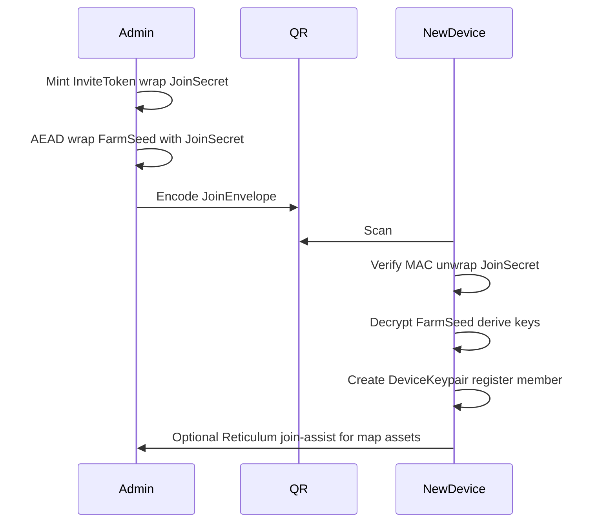

# Mist network & storage (experimental fork)

**Status:** Design workshop — **not** the production path.  
**Date:** 2026-08-02  
**Product:** PUF-AM (Ag Manager)

Firebase Auth + invite PINs + Firestore remain the **working production stack**. Mist work must land as an **experimental fork** (branch / feature flag / separate package path) so it cannot break PIN login or Cloud Run hosting.

Authoritative short pointer: [`DEVELOPER_NOTES.md`](../DEVELOPER_NOTES.md) § Mist (experimental).

---

## Vision (“mist”, not cloud)

Users download APK / web / Windows–Linux EXE (macOS later). After setup the farm is **fully offline-capable**: local ESRI/basemap packs, boundaries, features, diary/records. No email registration — **name + invite token**; administrator holds a **one-time farm code** (paper wallet).

Connectivity and durability layers:

| Plane | Role |
|-------|------|
| **Local-first** | Authoritative day-to-day copy on each terminal |
| **Reticulum** | On-farm mesh (LoRa RNodes / multi-hop): telemetry, temp messages, map heads-up + asset pull — no Wi‑Fi infrastructure required |
| **Freenet-style mist** | Encrypted, compressed, fragmented durable **records** across opt-in peers worldwide |
| **Offline backups** | Automated encrypted exports (USB/NAS/user cloud) — real multi-year insurance |

Anyone running the app *may* host opaque encrypted fragments. Preferential replication to the farm’s own members and optional shed/Pi pins. No subscriptions; no central operator required for core operation.

---

## Data placement (locked workshop decisions)

| Data | Primary home | Signal / sync |
|------|----------------|---------------|
| Live telemetry, personnel movement, temporary messages | — | **Reticulum only** |
| Boundaries, infrastructure, static map features, tile packs | **Local** on each terminal | Change-only; Reticulum heads-up + Resource pull |
| Diary, records, plans (recent) | Local cache + **Freenet Hot contract** | Freenet sync |
| Older diary/records/plans | Local cache (user retention) + **Freenet Archive contracts** | Manifest → on-demand pull |
| Full restore | Mist + any member’s local copy + offline backup | Slow path — acceptable |

### Freenet shape: hot + archive + manifest

Freenet replicates each **contract** across peers; it does **not** automatically split one logical archive into many contracts or apply erasure coding. Application-level design:

- **Manifest** — small index: hot key, archive keys, periods, content hashes.
- **Hot** — last **90 days** of records (default); append-friendly deltas.
- **Archive** — sealed time slices (**one contract per calendar year** in v1; season labels later without changing seal protocol); mostly immutable; keep each well under tens of MB (hard cap ~50 MiB per contract).
- Optional: 2–3 location-diverse copies of critical archives; compression (e.g. zstd) before state bytes.
- Phones: lightweight / on-demand Freenet peer; prefer one always-on **shed pin** per farm.

**Longevity:** treat Freenet as multi-device sync + short-to-medium redundancy. Multi-year survival = local caches + automated offline backups + at least one subscribed pin. Re-seed from any member who still has data.

### Map heads-up (Reticulum)

On map change: bump `map_version`, announce short `map_update` to farm destination; terminals compare hashes and pull assets over Reticulum Resource (hash-verify before replace). Large tiles never enter the global mist day-to-day.

---

## Experimental fork rules

1. **Do not** replace Firebase Auth / `access_pins` / Cloud Run in `master` until mist path is proven.
2. Mist prototypes live under an explicit flag or package path (e.g. `src/mist/` / `Plans` spikes / branch `exp/mist-*`).
3. Production invite PIN flow ([`AUTH_INVITE_PIN.md`](AUTH_INVITE_PIN.md)) stays source of truth for shipping builds.
4. DPIRD / optional online APIs remain temporary enhancements during migration; local data model must not require them.

Prototype order:

1. Invitation → key derivation → contract / destination material (**this doc § Invitation**).
2. Local event log / CRDT-friendly store.
3. Reticulum map heads-up + small geometry sync.
4. Freenet Hot contract.
5. Archive sealing + Manifest.

---

## Invitation → key derivation → contract keys

Goal: map **paper farm code** + **invite token** + **member name** onto cryptographic material for (a) decrypting farm mist contracts, (b) joining Reticulum farm destinations, (c) proving invite without a central account DB — while remaining compatible with a future bridge from today’s PIN system.

### Roles of secrets

| Secret | Held by | Purpose |
|--------|---------|---------|
| **Farm root code** (`FarmCode`) | Admin only; paper wallet | High-entropy secret that seeds all farm-scoped keys. Shown once at farm creation. Losing it without a backup = loss of mist recovery keys (local data may still exist). |
| **Invite token** | New member (shared out-of-band) | Short capability to join once (or N uses / expiry). Does **not** equal FarmCode. |
| **Member display name** | User | Human label; with invite, binds a stable member/device identity (same spirit as today’s PIN+name → UID). |
| **Device keypair** | Each terminal | Long-lived device identity for signing records and Reticulum destinations. |

### Recommended derivation (v1 sketch)

Use a standard KDF (HKDF-SHA-256). All labels are ASCII domain-separation strings. Exact byte layouts can freeze when the experimental package lands.

```
FarmSeed     = HKDF(ikm = FarmCode_bytes, salt = "pufam-mist-v1", info = "farm-seed")
FarmId       = first 16 bytes of HKDF(FarmSeed, info = "farm-id")   // public farm handle
ManifestKey  = HKDF(FarmSeed, info = "freenet-manifest")
HotKey       = HKDF(FarmSeed, info = "freenet-hot")
ArchiveSalt  = HKDF(FarmSeed, info = "freenet-archive-salt")
# archive contract key for period P:
ArchiveKey(P) = HKDF(ArchiveSalt, info = "archive:" || P)

ReticulumFarmDest   = HKDF(FarmSeed, info = "reticulum-farm-dest")
MapAnnounceDest     = HKDF(FarmSeed, info = "reticulum-map-announce")
TelemetryDest       = HKDF(FarmSeed, info = "reticulum-telemetry")
JoinAssistDest      = HKDF(FarmSeed, info = "reticulum-join")

InviteMaster = HKDF(FarmSeed, info = "invite-master")
```

See **§ Reticulum destination naming** for traffic rules.

**Invite token mint (admin device, offline-capable):**

```
InviteId     = random 128-bit
InviteToken  = encode(InviteId || MAC)   // human-typable: Crockford base32 / grouped digits
InviteRecord = {
  invite_id, role, modules?, expires?, max_uses?,
  wrapped_join_secret = AEAD(InviteMaster, InviteId, JoinSecret)
}
JoinSecret   = random 256-bit   // enough to receive FarmSeed unwrap OR a join capability
```

Store `InviteRecord` only on admin device / mist invite index contract (experimental) — **not** in production Firestore for the fork spike unless bridged deliberately.

**Join (new device):**

1. User enters farm discovery handle (optional nearby / QR) + **name** + **InviteToken**.
2. Device verifies MAC, unwraps `JoinSecret`, runs join protocol to obtain `FarmSeed` (or a wrapped `FarmSeed` decryptable with `JoinSecret`).
3. Device generates **DeviceKeypair**; registers member record `{ member_id, name, device_pub, role }` into local DB + (later) Hot/membership contract.
4. Derive Manifest/Hot/Archive/Reticulum keys from `FarmSeed` as above.
5. Mark invite used / decrement uses.

**Paper wallet contents (admin):**

- Farm display name  
- `FarmCode` (full secret)  
- Optional: first recovery invite  
- Created date / schema version `mist-v1`

**Recovery:** any device that still holds `FarmSeed` (or an offline backup of encrypted state + `FarmCode`) can re-derive keys and re-publish Manifest/Hot/Archives. Without `FarmCode` and without a seeded peer, mist ciphertext is unreadable by design.

### Bridge note (production Firebase)

Today: PIN → SHA-256 → `access_pins` → custom token ([`AUTH_INVITE_PIN.md`](AUTH_INVITE_PIN.md)).  
Mist fork: do **not** replace that path in shipping builds. Optional later bridge: “export FarmCode from admin after PIN login” or dual-write invite material — only after experimental crypto is stable.

### Record IDs (for Hot merge)

```
record_id = ulid_or_timeordered || "-" || short_device_id || "-" || counter
```

Prefer globally unique IDs so Hot merge is append-by-id + tombstone union (see Freenet Hot sketch below).

---

## Join bootstrap (QR v1)

First join is **offline-capable**. QR is the v1 carrier; USB/file and Reticulum announce are secondary. NFC later.



### JoinEnvelope

Versioned JSON, then compressed (e.g. zstd) and encoded as Crockford base32 (or QR binary) for scanning:

| Field | Role |
|-------|------|
| `v` | `"mist-join-1"` |
| `farm_id` | Public farm handle (hex/base32 of `FarmId`) |
| `farm_name` | Display only |
| `invite_token` | Human-typable invite (or `invite_id` + `mac`) |
| `wrapped_farm_seed` | AEAD(`JoinSecret`, nonce, `FarmSeed`) so a pure-offline scan obtains `FarmSeed` without a live peer |
| `role` | `admin` \| `farmer` \| `viewer` (capability at join) |
| `expires` | ISO timestamp or null |
| `schema` | `1` |

Admin embeds `wrapped_farm_seed` at mint time (admin device already holds `FarmSeed`).

### Security

- Treat the QR as sensitive as the invite token (anyone who scans can join until the invite is spent/expired).
- Prefer **single-use** invites for field crew.
- **Paper wallet** still holds full `FarmCode` for recovery; QR join is not a substitute for the paper root.
- After join, rotate/mark invite used on the admin device (and later on a mist invite-index contract if present).

### Mesh path (same keys)

If new device and admin are both on Reticulum, the same `JoinEnvelope` may be sent as LXMF / Resource to `JoinAssistDest` instead of QR. Cryptography is identical. Large map assets after join use Resource/Link on `JoinAssistDest` or farm group — never Freenet for tile packs.

### Secondary carriers

- USB / file: `JoinEnvelope` as `.pufam-join` (or similar) for air-gapped handoff.
- Typed invite alone (no QR): requires a live peer that can unwrap `FarmSeed` for `JoinSecret` — not required for v1 if QR always carries `wrapped_farm_seed`.

---

## Reticulum destination naming

All destinations derive from `FarmSeed` via HKDF (see § Invitation). Freeze these **info** strings for mist-v1:

| Destination | HKDF `info` | Traffic |
|-------------|-------------|---------|
| Farm group | `reticulum-farm-dest` | Membership, general on-farm mesh |
| Map announce | `reticulum-map-announce` | `map_update` heads-up only |
| Telemetry | `reticulum-telemetry` | Personnel / sensors / ephemeral messages |
| Join assist | `reticulum-join` | Optional live handoff of join envelope extras / large map assets after QR |

### Implementer notes

- Map HKDF output bytes → Reticulum/RNS destination material per RNS conventions (exact API call left to the experimental spike).
- **Heads-up** JSON must stay LoRa-friendly: multi-packet or LXMF; do not put GeoJSON/tiles in announce payloads.
- **Large assets** (boundaries file, tile packs): Reticulum Resource or Link only; hash-verify before replacing local copy.
- Telemetry is never mirrored to Freenet.

### Map heads-up flow (recap)

1. Authorised user updates local map assets; bumps `map_version`.
2. Publish short `map_update` to `MapAnnounceDest` (see payload sketch below).
3. Peers compare `map_version` / asset hashes; pull changed assets from sender or any peer that already has them.
4. Off-farm members: optional later fallback if map manifest is also published to mist (not required for v1 on-farm operation).

---

## Hot → Archive seal lifecycle

**Defaults (mist-v1):**

| Parameter | Value |
|-----------|--------|
| Hot window | **90 days** |
| Archive partition | **One contract per calendar year** (`P = "YYYY"`) |
| Seal actors | Any **admin** device; also **automated** when thresholds hit |
| Auto triggers | `window_start` older than 90 days, **or** hot uncompressed JSON ≳ 1–2 MB, **or** admin “Seal year” |

### Protocol

1. **Trigger** — age, size, or admin action for period `P`.
2. **Select** — records in Hot with `ts` ∈ calendar year `P` (and older than the retained hot window if sealing a sliding window mid-year).
3. **Build** — Archive state (JSON list or zstd blob) + `content_hash` (SHA-256 of sealed bytes).
4. **Publish** — Archive contract at `ArchiveKey(P)`.
5. **Manifest** — `version++`; append `{ key, period, from, to, record_count, content_hash, created }`.
6. **Hot cleanup** — remove sealed record payloads from Hot (tombstone ids optional); advance `window_start` / set `last_sealed`.
7. **Device reconcile** — on sync, read Manifest first; pull any missing Archive contracts on demand (single-record / year slice = fast path; full restore = slow path).

### Failure / idempotency

- If Archive publish succeeds but Manifest update fails: retry Manifest with the same `period` + `content_hash` (idempotent).
- Repair rule: “archive exists for `P` → Manifest must list it” — run on next admin online.
- Do not create a second divergent archive for the same `P` unless `content_hash` matches; conflicting hashes require admin resolution (experimental: prefer first sealed hash, surface alert).

### Erasure coding

Optional later: application-level Reed–Solomon fragments as separate contracts. **Not** mist-v1; Freenet already replicates each whole contract.

---

## Contract state sketches (reference)

### Manifest

```json
{
  "farm_id": "…",
  "version": 1,
  "hot_contract_key": "…",
  "archives": [
    {
      "key": "…",
      "period": "2025",
      "from": "2025-01-01T00:00:00Z",
      "to": "2025-12-31T23:59:59Z",
      "record_count": 1842,
      "content_hash": "sha256:…",
      "created": "2026-01-02T04:12:00Z"
    }
  ],
  "schema_version": 1
}
```

### Hot

```json
{
  "farm_id": "…",
  "window_start": "2026-05-01T00:00:00Z",
  "records": [
    {
      "id": "…",
      "type": "spray|harvest|observation|plan|diary|…",
      "ts": "…",
      "author": "member-or-device-id",
      "payload": {},
      "sig": "optional"
    }
  ],
  "tombstones": [],
  "last_sealed": null
}
```

Merge: append-only by `id`; union tombstones; summary = ids + window_start + count.

### Archive (sealed)

```json
{
  "farm_id": "…",
  "period": "2025",
  "from": "…",
  "to": "…",
  "records": [],
  "content_hash": "sha256:…",
  "sealed_at": "…",
  "sealed_by": "admin-device-id"
}
```

Or compressed opaque blob + hash check.

### Map update heads-up (Reticulum)

```json
{
  "type": "map_update",
  "farm_id": "…",
  "map_version": 17,
  "updated": "…",
  "changed_assets": ["boundaries-v3", "infrastructure-2026"],
  "priority": "normal",
  "sender": "device-id"
}
```

---

## Open items (next pressure tests)

- [x] Join bootstrap / QR `JoinEnvelope` (v1) — see **§ Join bootstrap**.
- [x] Reticulum destination naming (`farm` / `map` / `telemetry` / `join`) — see **§ Reticulum destination naming**.
- [x] Seal/cron rules for Hot → Archive — see **§ Hot → Archive seal lifecycle**.
- [ ] Freeze FarmCode encoding (entropy bits, printable alphabet / Crockford groups).
- [ ] Invite-index persistence on admin device after QR mint (local only vs mist invite contract).
- [ ] Mobile peer policy (default contribute-storage = off).
- [ ] Exact RNS API mapping: HKDF bytes → destination identity (spike).

---

## Related docs

- [`AUTH_INVITE_PIN.md`](AUTH_INVITE_PIN.md) — production PIN auth (do not break).  
- [`OFFLINE_MAP_APK.md`](OFFLINE_MAP_APK.md) — local basemap packs / device transfer.  
- [`CREW_PRESENCE.md`](CREW_PRESENCE.md) — live presence (maps to Reticulum telemetry later).  
- [`ROADMAP.md`](ROADMAP.md) — product roadmap (mist remains experimental until promoted).
