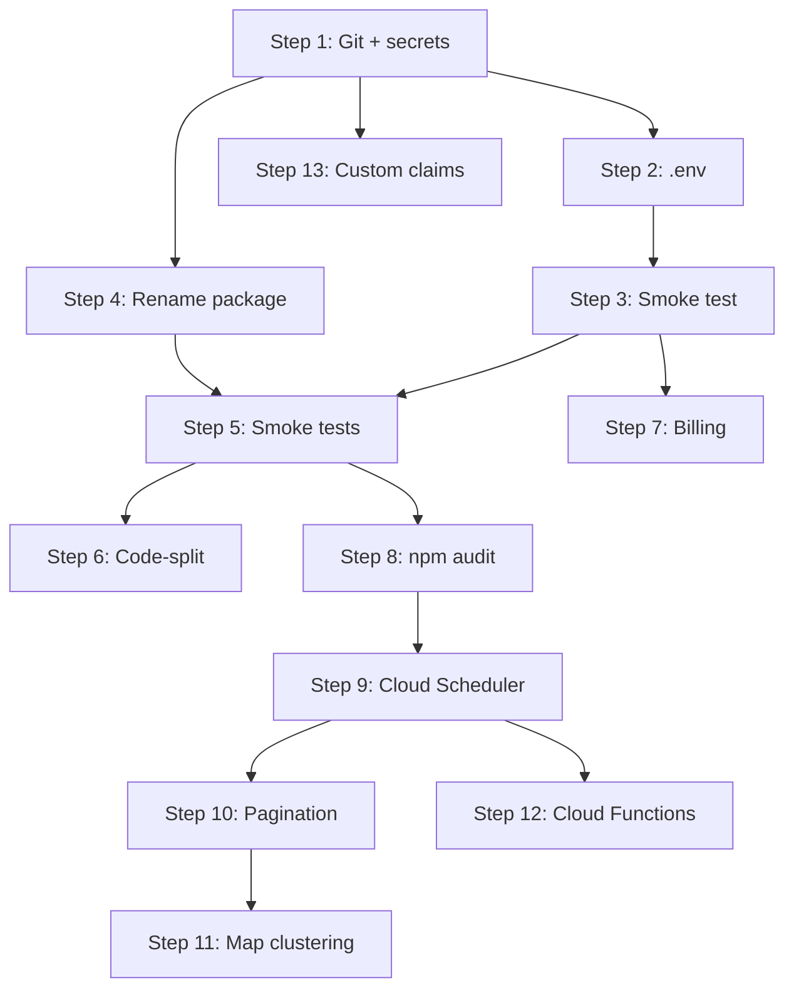

# PUFAM (Ag Manager) — Production Roadmap

**Created:** 13 July 2026  
**Last updated:** 13 August 2026 (docs audit; Phase E crop packs / plugins / blight / desktop)  
**Status:** Active — Phases A–C code complete; Phase D polish mostly done (D-07 mesh P3 open); Phase E crop-pack + blight + desktop Freenet in code, zip-as-engine still next  
**Public name:** PUFAM — Ag Manager (local clone folder `PUF-AM`)  
**Companion doc:** [DEVELOPER_NOTES.md](../DEVELOPER_NOTES.md) §5 (13-step checklist)  
**Rename:** [RENAME_TO_PUFAM.md](./RENAME_TO_PUFAM.md) · **Farm types:** [FARM_TYPES.md](./FARM_TYPES.md)

---

## Purpose

This roadmap turns the post-assessment recommendations into an ordered, trackable plan. Steps are grouped into three phases:

| Phase | Steps | Goal |
|-------|-------|------|
| **A — Workshop readiness** | 1–4 | Safe local dev, version control, correct project identity |
| **B — Beta readiness** | 5–8 | Tests, bundle size, feature hygiene, dependency security |
| **C — Production / scale** | 9–13 | Backend offload, pagination, map performance, proper admin auth |

**How to use this doc**

1. Work steps in order within each phase unless a dependency note says otherwise.
2. When starting a step, set its status to `in_progress` and add a line to the **Progress log** at the bottom.
3. When done, set status to `done`, record the completion date, and note any deviations.
4. Mirror status changes in `DEVELOPER_NOTES.md` §5 checklist.

**Status legend:** `not_started` · `in_progress` · `blocked` · `done` · `deferred`

---

## Dependency graph

---

## Phase A — Workshop readiness

### Step 1 — Initialize git and protect secrets

| Field | Value |
|-------|-------|
| **ID** | `STEP-01` |
| **Status** | `done` |
| **Priority** | P0 |
| **Depends on** | — |
| **Owner** | — |
| **Completed** | 2026-07-13 |

**Problem:** No version control. `firebase-applet-config.json` contains live Firebase credentials and is not gitignored.

**Tasks**

- [x] Run `git init` in `c:\Projects\Walnut_farm_manager`
- [x] Add to `.gitignore`:
  - `firebase-applet-config.json`
  - `firebase-blueprint.json` (if it contains project-specific IDs)
  - Keep `!.env.example` (already present)
- [x] Add `firebase-applet-config.example.json` with placeholder values (no real keys)
- [x] Document clone/setup flow in README: copy example → fill credentials
- [ ] Create initial commit (only when user explicitly requests)

**Acceptance criteria**

- `git status` works; secrets files are ignored
- Fresh clone can follow README + example config to run the app
- No API keys or project IDs committed in tracked files

**Files**

- `.gitignore`
- `firebase-applet-config.example.json` (new)
- `README.md`

**Risks**

- Existing `firebase-applet-config.json` may already be in backup/sync paths — verify OneDrive or other mirrors

---

### Step 2 — Create local `.env` from template

| Field | Value |
|-------|-------|
| **ID** | `STEP-02` |
| **Status** | `done` |
| **Priority** | P0 |
| **Depends on** | STEP-01 |
| **Owner** | — |
| **Completed** | 2026-07-13 |

**Problem:** App requires DPIRD and Google Maps keys; `.env` is gitignored and not present on a fresh clone.

**Tasks**

- [x] Copy `.env.example` → `.env` (local only, never committed)
- [ ] Populate:
  - `DPIRD_API_KEY` — weather proxy server-only (`server/envSecrets.ts`; never `VITE_`)
  - `VITE_GOOGLE_MAPS_API_KEY` — map tiles (`GoogleMapsLayer.tsx`; restrict per `Plans/API_KEY_SECURITY.md`)
  - `APP_URL` — `http://localhost:3000` for local dev
- [x] Verify `dotenv.config()` in `server.ts` loads server vars
- [x] Verify Vite exposes `VITE_*` vars to the client build
- [x] Add a startup check script or server log warning when keys are missing

**Acceptance criteria**

- `npm run dev` starts without key-related 401 errors for configured services
- Missing keys produce clear console warnings, not silent failures

**Files**

- `.env` (local)
- `.env.example`
- Optionally `server.ts` — key validation on boot

---

### Step 3 — Smoke-test dev server against Firebase

| Field | Value |
|-------|-------|
| **ID** | `STEP-03` |
| **Status** | `done` |
| **Priority** | P0 |
| **Depends on** | STEP-02 |
| **Owner** | — |
| **Completed** | 2026-07-13 |
| **Note** | Automated smoke tests PASS; browser/auth CRUD pending real API keys in `.env` |

**Problem:** Build passes but runtime behaviour (auth, Firestore, weather proxy, map) has not been verified in this workspace.

**Tasks**

- [x] Run `npm run dev` → confirm `http://localhost:3000` loads
- [ ] **Auth:** Google sign-in completes; user doc created in Firestore
- [ ] **Dashboard:** Weather data loads (DPIRD proxy or cache)
- [ ] **Orchard Map:** Blocks render; draw/edit saves to `farms/{farmId}/blocks`
- [ ] **Blight Risk:** Risk chart renders with weather + diary data
- [ ] **Farm Diary:** Create spray event; appears in list and affects blight
- [ ] **Harvest:** Create record; drying session link works
- [ ] **Offline:** `OfflineIndicator` shows when network disabled; cached reads work
- [x] Record results in `Plans/SMOKE_TEST_LOG.md` (pass/fail per route)

**Acceptance criteria**

- All core routes load without uncaught errors
- At least one CRUD cycle per major collection succeeds
- Smoke test log documents date, tester, and outcome

**Files**

- `Plans/SMOKE_TEST_LOG.md` (new)

---

### Step 4 — Rename package identity

| Field | Value |
|-------|-------|
| **ID** | `STEP-04` |
| **Status** | `done` |
| **Priority** | P1 |
| **Depends on** | STEP-01 |
| **Owner** | — |
| **Completed** | 2026-07-13 |

**Problem:** `package.json` still uses the AI Studio template name `react-example`.

**Tasks**

- [x] Rename `name` to `walnut-farm-manager`
- [x] Set `version` to `0.1.0` (or agreed semver)
- [x] Add `description` matching README
- [x] Align `metadata.json` name if needed (now "PUFAM")
- [x] Search repo for `react-example` references and update (`package-lock.json`)

**Acceptance criteria**

- `package.json` reflects project identity
- `npm run build` and `npm run lint` still pass

**Files**

- `package.json`
- `package-lock.json` (auto-updated on next install)

---

## Phase B — Beta readiness

### Step 5 — Add smoke tests (blight, dryer, API proxy)

| Field | Value |
|-------|-------|
| **ID** | `STEP-05` |
| **Status** | `done` |
| **Priority** | P1 |
| **Depends on** | STEP-03, STEP-04 |
| **Owner** | — |
| **Completed** | 2026-07-13 |

**Problem:** Vitest is configured but `npm test` finds zero test files.

**Tasks**

- [x] Add `vitest.config.ts` if missing (jsdom, path aliases matching `vite.config.ts`)
- [x] **Unit tests:**
  - `src/lib/blightModel.test.ts` — known weather + spray inputs → expected threat range
  - `src/lib/dryingModel.test.ts` — moisture curve fit → predicted target date
- [x] **API tests** (optional integration, mock fetch):
  - `tests/api/health.test.ts` — `GET /api/health`
  - Blight endpoint shape validation with fixture payload
- [x] Wire `npm test` in CI-ready form (exit 0 on pass)
- [x] Document how to run tests in README

**Acceptance criteria**

- `npm test` runs ≥3 meaningful tests, all passing
- Blight and dryer models have regression coverage for at least one golden fixture each
- Tests do not require live Firebase or DPIRD keys (use mocks/fixtures)

**Files**

- `vitest.config.ts`
- `src/lib/blightModel.test.ts`
- `src/lib/dryingModel.test.ts`
- `tests/` or colocated `*.test.ts`

---

### Step 6 — Code-split heavy routes

| Field | Value |
|-------|-------|
| **ID** | `STEP-06` |
| **Status** | `done` |
| **Priority** | P1 |
| **Depends on** | STEP-05 |
| **Owner** | — |
| **Completed** | 2026-07-13 |

**Problem:** Production bundle is ~4.1 MB (gzip ~1 MB). Initial load is slow on orchard mobile networks.

**Tasks**

- [x] Convert route imports in `App.tsx` to `React.lazy()` + `Suspense`
- [x] Priority lazy routes (largest / least-used on first paint):
  - `OrchardMap`
  - `Financials`
  - `WaterMonitoring`
  - `Nutrition`
  - `FieldOps` (removed 2026-08-13 — route now redirects to `/map`)
- [x] Add route-level loading fallback (spinner consistent with `ProtectedRoute`)
- [x] Configure `build.rollupOptions.output.manualChunks` for:
  - `vendor-react` (react, react-dom, react-router)
  - `vendor-firebase`
  - `vendor-leaflet`
  - `vendor-charts` (recharts)
- [x] Measure before/after bundle sizes; record in this doc

**Acceptance criteria**

- Main chunk < 1.5 MB (or ≥40% reduction from baseline)
- No regression in route navigation (lazy routes load correctly)
- `npm run build` passes; Lighthouse or manual check shows faster first paint

**Baseline (13 Jul 2026)**

| Chunk | Size (min) | Gzip |
|-------|------------|------|
| `index-*.js` | 4,110 KB | 1,084 KB |

**After (13 Jul 2026 — Phase B)**

| Chunk | Size (min) | Gzip |
|-------|------------|------|
| `index-*.js` (initial) | **290 KB** | **89 KB** |
| `vendor-firebase` | 643 KB | 153 KB |
| `vendor-leaflet` | 271 KB | 73 KB |
| `vendor-charts` | 440 KB | 128 KB |
| `vendor-react` | 232 KB | 74 KB |
| Route chunks (lazy) | 6–404 KB each | loaded on demand |

**Reduction:** 93% smaller initial JS chunk (4,110 → 290 KB minified)

**Target**

| Chunk | Target (min) | Target (gzip) |
|-------|--------------|---------------|
| Initial route | < 1,500 KB | < 400 KB |

**Files**

- `src/App.tsx`
- `vite.config.ts`

---

### Step 7 — Wire or remove Billing page

| Field | Value |
|-------|-------|
| **ID** | `STEP-07` |
| **Status** | `done` |
| **Priority** | P2 |
| **Depends on** | STEP-03 |
| **Owner** | — |
| **Completed** | 2026-07-13 |

**Problem:** `Billing.tsx` exists but is not routed; `Layout.tsx` imports `CreditCard` icon but Billing is not in navigation. Subscription tiers exist in auth model without payment backend.

**Decision:** **Option B — Remove** (updated 2026-07-13). Billing page, `/billing` route, System nav item, and Settings link deleted. Monetization remains out of scope until explicitly reopened.

| Option | Description |
|--------|-------------|
| **A — Defer** | Keep page file; add route `/billing`; "Coming Soon" banner. |
| **B — Remove** ✓ | Delete `Billing.tsx` and dead imports until monetization phase. |
| **C — Implement** | Stripe Checkout + webhook + `subscriptionTier` sync (large scope). |

**Tasks**

- [x] Remove route `billing` from `App.tsx`
- [x] Remove Billing from nav (`navConfig`) and Settings
- [x] Delete `src/pages/Billing.tsx`
- [x] Keep `subscriptionTier` field in auth model (no payment UI)
- [x] Document monetization as future phase in this roadmap

**Acceptance criteria**

- No Billing page, route, or nav entry
- Decision recorded in Progress log

**Files**

- `src/App.tsx`
- `src/lib/navConfig.ts`
- `src/pages/Settings.tsx`

---

### Step 8 — npm audit and critical vulnerability remediation

| Field | Value |
|-------|-------|
| **ID** | `STEP-08` |
| **Status** | `done` |
| **Priority** | P1 |
| **Depends on** | STEP-05 |
| **Owner** | — |
| **Completed** | 2026-07-13 |

**Problem:** `npm audit` reported 34 vulnerabilities (2 critical, 13 high) after install (13 Jul 2026).

**Tasks**

- [x] Run `npm audit` and save full report to `Plans/AUDIT_LOG.md`
- [x] Run `npm audit fix` (non-breaking)
- [x] For remaining critical/high: trace dependency chain (likely `xlsx`, `html2pdf`, transitive `glob`)
- [x] Evaluate upgrades or replacements:
  - `xlsx` — no npm fix; documented as accepted risk (nutrition client-side parsing only)
  - Removed unused `firebase-admin` — cleared uuid/google-gax chain
- [x] Re-run `npm test` and `npm run build` after each upgrade batch
- [x] Document accepted risks with justification if not fixable

**Result:** 34 → 2 vulnerabilities (0 critical, 1 high, 1 low). See `Plans/AUDIT_LOG.md`.

**Acceptance criteria**

- Zero **critical** vulnerabilities, or each documented with mitigation
- High vulnerabilities reduced by ≥50% or documented
- Build and tests still pass

**Files**

- `package.json`
- `package-lock.json`
- `Plans/AUDIT_LOG.md` (new)

---

## Phase C — Production / scale

### Step 9 — Cloud Scheduler for DPIRD weather

| Field | Value |
|-------|-------|
| **ID** | `STEP-09` |
| **Status** | `done` |
| **Priority** | P1 |
| **Depends on** | STEP-08 |
| **Owner** | — |
| **Completed** | 2026-07-13 |
| **Note** | Functions code ready; Firebase deploy + `DPIRD_API_KEY` secret required |

**Problem:** Client-triggered weather cache refresh causes thundering herd against DPIRD when many users open the app simultaneously (`DEVELOPER_NOTES.md` §2B).

**Tasks**

- [x] Create `functions/` or `cloud/` directory for Firebase Cloud Functions
- [x] Implement scheduled function (hourly):
  - Fetch DPIRD for configured station list (Manjimup / regional anchors)
  - Write to shared `weather_cache/{stationCode}` collection
- [ ] Configure Cloud Scheduler → Pub/Sub → Function (deploy: `cd functions && npm run deploy`)
- [x] Update `weatherService.ts` to **read cache only** on client in production; remove direct DPIRD fetch from browser
- [x] Keep `server.ts` proxy for dev fallback only
- [x] Add cache staleness indicator in UI (last updated timestamp on Dashboard + Blight Risk)
- [ ] Deploy and verify single hourly fetch in Firebase logs

**Acceptance criteria**

- No client-side DPIRD API calls in production build
- Cache document updated on schedule; clients read ≤1 Firestore doc per station
- Blight and Dashboard still receive fresh enough data (≤2 h stale max)

**Files**

- `functions/src/weatherScheduler.ts` (new)
- `src/lib/weatherService.ts`
- `firebase.json` (new)
- `DEVELOPER_NOTES.md` §2B — mark addressed

---

### Step 10 — Pagination for events, harvests, transactions

| Field | Value |
|-------|-------|
| **ID** | `STEP-10` |
| **Status** | `done` |
| **Priority** | P1 |
| **Depends on** | STEP-09 |
| **Owner** | — |
| **Completed** | 2026-07-13 |

**Problem:** App loads full history collections on login — Firestore read costs and payload size grow without bound (`DEVELOPER_NOTES.md` §2C).

**Tasks**

- [x] Define pagination contract in `api.ts`:
  - `getEventsPaginated`, bbox filters on `getBlocks` / `getTracks`
  - Harvest + Financials already had cursor pagination (limit 20)
- [x] Default window: last 90 days for diary events
- [x] Add "Load older events" in `FarmDiary.tsx`
- [x] Add Firestore composite indexes in `firestore.indexes.json` for `date` queries
- [ ] For analytics spanning full history: read from `aggregates/` (partial — Dashboard/BlightRisk use blight aggregate)
- [ ] Track read count reduction in dev tools or metrics

**Acceptance criteria**

- Initial page load fetches ≤100 documents per paginated collection
- User can explicitly load older data
- No functional regression for seasonal workflows (current season visible by default)

**Files**

- `src/services/api.ts`
- `src/pages/FarmDiary.tsx`
- `src/pages/Harvest.tsx`
- `src/pages/Financials.tsx`
- `firestore.indexes.json`

---

### Step 11 — Map clustering and bounding-box queries

| Field | Value |
|-------|-------|
| **ID** | `STEP-11` |
| **Status** | `done` |
| **Priority** | P1 |
| **Depends on** | STEP-10 |
| **Owner** | — |
| **Completed** | 2026-07-13 |
| **Note** | Clustering + guard shipped; **viewport culling was never wired** (see tasks); Layer Settings never built |

**Problem:** All blocks, tracks, and event markers render as DOM/SVG at once — mobile browsers choke at scale (`DEVELOPER_NOTES.md` §2A, `OrchardMap.tsx` TODOs).

**Tasks**

- [x] **Event markers:** `leaflet.markercluster` via `EventMarkerCluster.tsx`
- [ ] **Blocks/tracks:** bounds filtering exists but is unused. `mapApi.getBlocks/getPins/getTracks` take an optional bounds arg that `farmGeometrySync.ts:104` never passes, it is a hand-rolled point-walk rather than Turf, and `filterByBounds` (`mapStore.ts:111`) deliberately no-ops for polygons. Only pins are filtered, only at load.
- [ ] Debounce before refetch. `useOrchardMapViewport.ts:126` debounces `moveend`/`zoomend` at 500 ms (not 300 ms in `mapStore.ts`), but `setBounds` only stores the box — no refetch, and `orchardMapLayerSync.ts` never reads it. **Nothing is viewport-culled** — design in [`MAP_VIEWPORT_CULLING.md`](MAP_VIEWPORT_CULLING.md); measure with the guard before building.
- [x] Performance guard: warn above 500 rendered features (`mapFeatureLoad.ts` + toolbar banner). Warn only — `CODEBASE_HEALTH.md` forbids rebuilding GeoJSON layers on pan/zoom, so no level-of-detail pass.
- [x] **Live Telemetry Mock:** deleted from `EditInfraSidebar.tsx` (`8003949`) — no gate needed
- [ ] Add "Layer Settings" when real layers ship — never built, so there is no stub to hide

**Acceptance criteria**

- Map pan/zoom stays ≥30 fps on mid-range mobile with 200+ blocks (test with generated fixtures)
- Event markers cluster at low zoom
- `OrchardMap.tsx` enterprise TODOs marked done or superseded

**Files**

- `src/pages/OrchardMap.tsx`
- `src/services/api.ts`
- `src/lib/mapStore.ts`
- `src/lib/mapFeatureLoad.ts`
- `src/components/map/OrchardMapToolbar.tsx`

---

### Step 12 — Cloud Functions for blight and financial aggregates

| Field | Value |
|-------|-------|
| **ID** | `STEP-12` |
| **Status** | `done` |
| **Priority** | P2 |
| **Depends on** | STEP-09, STEP-10 |
| **Owner** | — |
| **Completed** | 2026-07-13 |
| **Note** | Functions code ready; deploy required; CF unit tests deferred |

**Problem:** Blight engine and profitability math run on the client — freezes UI on weak devices (`DEVELOPER_NOTES.md` §2D).

**Tasks**

- [x] **Blight aggregate function:** nightly + `onDiaryEventWrite` → `farms/{farmId}/aggregates/blight_daily`
- [x] **Financial aggregate function:** `syncFinancialAggregates` on transaction write
- [x] Update `Dashboard.tsx`, `BlightRisk.tsx`, `Financials.tsx` to read aggregates first; client calc fallback in dev
- [x] Dev Express endpoint retained for local weather parity
- [ ] Add function unit tests with fixtures

**Acceptance criteria**

- Dashboard blight score loads from aggregate doc (1 read) without client-side `runBlightModel` on full history
- Financials summary cards use aggregate doc for current period
- Local dev still works without deployed functions (feature flag or dev fallback)

**Files**

- `functions/src/blightAggregate.ts`
- `functions/src/financialAggregate.ts`
- `src/pages/BlightRisk.tsx`
- `src/pages/Dashboard.tsx`
- `src/pages/Financials.tsx`
- `server.ts` (dev parity)

---

### Step 13 — Replace hardcoded admin email with Firebase custom claims

| Field | Value |
|-------|-------|
| **ID** | `STEP-13` |
| **Status** | `done` |
| **Priority** | P2 |
| **Depends on** | STEP-01, STEP-09 |
| **Owner** | — |
| **Completed** | 2026-07-13 |
| **Note** | Run `scripts/setAdminClaim.ts` for each admin UID after deploy |

**Problem:** Admin access is hardcoded to `georgecarmody@gmail.com` in `firestore.rules` and `Layout.tsx`. This does not scale and is a security maintenance burden.

**Tasks**

- [x] Define custom claim `admin: true` set via Admin SDK script
- [x] Create `scripts/setAdminClaim.ts`
- [x] Update `firestore.rules` `isAdmin()`: `request.auth.token.admin == true` OR Firestore `role == 'admin'`
- [x] Update `Layout.tsx`, `AuthContext.tsx`, `Settings.tsx`, `Admin.tsx`: `isAdmin` from token claims
- [x] Whitelist bypass uses admin claim (no hardcoded email)
- [x] Document admin provisioning in README
- [ ] Run `setAdminClaim.ts` for all designated admin UIDs in production

**Acceptance criteria**

- New admin can be granted access without code deploy (script or admin panel)
- Firestore rules pass Firebase emulator tests for admin / non-admin paths
- No `georgecarmody@gmail.com` string in application code (rules migration period excepted)

**Files**

- `firestore.rules`
- `src/components/Layout.tsx`
- `src/contexts/AuthContext.tsx`
- `src/pages/Admin.tsx`
- `scripts/setAdminClaim.ts` (new)

---

## Phase D — Product polish (post Phase C)

Not part of the original 13 steps. Track here so deploy ops and mixed-farm UX stay visible.

| ID | Item | Status | Notes |
|----|------|--------|-------|
| D-01 | Docs + About PUFAM wording; walnut pack gating copy | `done` | 2026-07-27 — About, README, Plans headers, PIN preset clamp |
| D-02 | Module / PIN toggles respect crop packs | `done` | Blight hidden without walnut pack; orphan catalog cleared on Save |
| D-03 | Map UX (draw hit-targets, mixed naming) | `done` | 2026-07-27 — draw bar hit pad, pan-without-point, Area/Block/Paddock naming |
| D-04 | Offline Phase 3 leftovers (NSD, photo queue, weather) | `done` | 2026-07-27 — photo outbox, weather IDB, Android NSD |
| D-05 | Map infrastructure types (dams / pipes / vehicles…) | `done` | 2026-07-28 — infra catalog + OrchardMap draw/edit/sidebar; season/station/aqua deep UIs remain later (FARM_TYPES.md) |
| D-05b | Dam texture + paddock area exclusions + internal zones | `done` | 2026-07-28 — water/hatch/gravel fills; areaHa net of dam/impassable; passable pads; see FARM_TYPES.md |
| D-06 | Cloud Run / mDNS / `.pufom` rename Phase B | `deferred` | Keep wire names until cutover |
| D-07 | Crew presence on map (cloud → LAN → mesh) | `in_progress` | P1+P2 done 2026-07-27; mesh P3 open — CREW_PRESENCE.md |
| D-08 | Map overlays (highlights / bread trails / paddock names) | `done` | 2026-07-28 — MAP_OVERLAYS.md; timed check-this + 2 min trails + name watermarks |
| D-03b | Tablet basemap blank (pack + skip/online) | `done` | 2026-07-27 — blob revoke, Esri-on-native, Capacitor Network |

**Deploy still pending from Phase C:** production secrets, `setAdminClaim.ts` for admin UIDs, optional Cloud Run service rename.

---

## Phase E — Crop packs, blight engine, desktop (post Phase D)

Not part of the original 13 steps. Track here so plugin work does not vanish between ROADMAP stamps.

| ID | Item | Status | Notes |
|----|------|--------|-------|
| E-01 | Crop-pack plugin contract + Settings → Plugins | `done` | CP-00–05, 2026-08-11/12 — `CROP_PACK_PLUGIN.md`; lifecycle UI is Settings → Plugins |
| E-02 | Blight engine params unify (BE-01–05) | `done` | PR stack #5–#9; walnut blight first consumer |
| E-03 | Desktop Freenet host + AppImage / portable | `done` | Phases 11a–11l; mist still experimental. Sizes ~157 MB AppImage / ~103 MB portable (12 Aug 2026) |
| E-04 | Chill portions on dashboard (packaged APK) | `done` | Walnut pack / species / tree cropKind; packaged Android weather/auth → Cloud Run |
| E-05 | Plugin zip drop (`plugins/`, `plugin.json`) | `done` | First-party `plugins/walnut_blight/` is catalog + engine defaults. React/Ji still in-app. `npm run plugins:pack` |
| E-06 | Dead-limb cleanup | `done` | 2026-08-13 — FieldOps/FieldMode/taskStore removed; `/field-ops` still redirects to `/map` |
| E-07 | Freenet operator holes | `in_progress` | Copy + UX done 2026-08-14 (holes 1, 2, 3-copy, 6, 7). Revoke-kick stays later. Hole 5 waits on E-08 |
| E-08 | APK Freenet network pack | `in_progress` | [`APK_FREENET_HOST.md`](APK_FREENET_HOST.md) — native PUT spike first; then isolated host, Join, Send |

---

## Progress log

Record every status change here (newest first).

| Date | Step | Action | Notes |
|------|------|--------|-------|
| 2026-08-14 | E-08 | APK Freenet host plan | Network pack in the APK; isolated process; native PUT is the go/no-go — `APK_FREENET_HOST.md` |
| 2026-08-14 | E-07 | Freenet holes copy + UX | Send PIN wording, Invite PIN leftovers, two-piece handoff, create→Send nudge, People hub empty-state |
| 2026-08-14 | E-07 | Freenet operator flow + holes plan | `FREENET_OPERATOR_FLOW.md` + `FREENET_HOLES.md`; in-app How this works on Sync / People / join gate |
| 2026-08-13 | E-06 | Dead-limb cleanup | Removed unused FieldOps page, FieldMode, taskStore, appStore; kept `/field-ops` → `/map` |
| 2026-08-13 | Docs | Audit stamp | ROADMAP / DEVELOPER_NOTES / crop-pack / Freenet sizes brought in line with code |
| 2026-08-12 | E-01–E-05 | Plugins + blight + chill | Settings → Plugins; zip `plugins/`; BE-05; chill dashboard routing |
| 2026-07-28 | D-05b | Dam texture + exclusions | Water/hatch/gravel SVG patterns; internal_passable / internal_impassable; areaHa via turf.difference vs subtracting pins; paddock exterior unchanged |
| 2026-07-28 | D-08 | Map overlays | Timed highlights, bread trails (2 min), paddock name watermarks — MAP_OVERLAYS.md |
| 2026-07-28 | D-05 | Map infrastructure | INFRA_TYPES (dam/pipe/vehicle/fuel/hazard + sensors); OrchardMap draw modes, geojson edit, sidebar chips, metadata notes/trackerId; Meshy live track future |
| 2026-07-27 | D-07 P2 | Crew presence (LAN hub) | `POST/GET /api/presence` + client poll/merge with cloud |
| 2026-07-27 | D-07 P1 | Crew presence (cloud) | `presence/{uid}` + CrewPresenceLayer + Settings share toggle |
| 2026-07-27 | D-04 | Offline Phase 3 | Photo Storage outbox; weather IDB + Cache weather; Android NSD hub scan |
| 2026-07-27 | D-03b | Tablet basemap | Blob URL revoke fix; Esri on Capacitor; Google fail→Esri; CREW_PRESENCE plan |
| 2026-07-27 | D-03 | Map UX | Draw hit-targets / pan-without-point; mixed Farm Map Area naming |
| 2026-07-27 | D-01–D-02 | Docs + crop-pack toggles | PUFAM About/docs pass; PIN presets + Farm modules clamp blight without walnut pack |
| 2026-07-13 | STEP-09–13 | Phase C complete (code) | Weather scheduler + cache; diary pagination; map clustering/bbox; blight/financial CF aggregates; custom claims admin. Deploy + secrets pending. || 2026-07-13 | STEP-07 | Billing removed | Deleted Billing page, route, nav, and Settings link (Option B) |
| 2026-07-13 | STEP-05–08 | Phase B complete | 11 Vitest tests; lazy routes + manualChunks (290 KB initial chunk); Billing initially Option A; audit 34→2 vulns |
| 2026-07-13 | STEP-01–04 | Phase A complete | Git init; secrets gitignored; `.env` created; package renamed; automated smoke tests logged (PARTIAL PASS — API keys pending) |
| 2026-07-13 | ALL | Roadmap created | Initial plan from post-assessment review. All steps `not_started`. |

---

## Related documents

| Document | Purpose |
|----------|---------|
| [DEVELOPER_NOTES.md](../DEVELOPER_NOTES.md) | Architecture notes, mist/Freenet phases, §5 checklist |
| [Plans/FREENET_OPERATOR_FLOW.md](./FREENET_OPERATOR_FLOW.md) | Freenet start / send / join / People as the code stands |
| [Plans/FREENET_HOLES.md](./FREENET_HOLES.md) | E-07 — how we address the seven known Freenet holes |
| [Plans/APK_FREENET_HOST.md](./APK_FREENET_HOST.md) | E-08 — Freenet network pack inside the APK |
| [Plans/PLUGIN_AUTHORING.md](./PLUGIN_AUTHORING.md) | How to add a crop pack (file list) |
| [Plans/CROP_PACK_PLUGIN.md](./CROP_PACK_PLUGIN.md) | Crop-pack contract, Settings → Plugins, zip drop folder |
| [Plans/SMOKE_TEST_LOG.md](./SMOKE_TEST_LOG.md) | Step 3 manual test results (create when running) |
| [Plans/AUDIT_LOG.md](./AUDIT_LOG.md) | Step 8 npm audit output (create when running) |
| [README.md](../README.md) | Setup instructions (update in Steps 1–2, 4) |

---

## Out of scope (future phases)

Tracked here so they do not derail the 13 steps:

- Stripe / subscription billing (Step 7 Option C)
- Email notifications (Settings — "Coming Soon")
- Vector tiles for map polygons
- Full CI/CD pipeline (GitHub Actions)
- Public distribution / auto-updater
